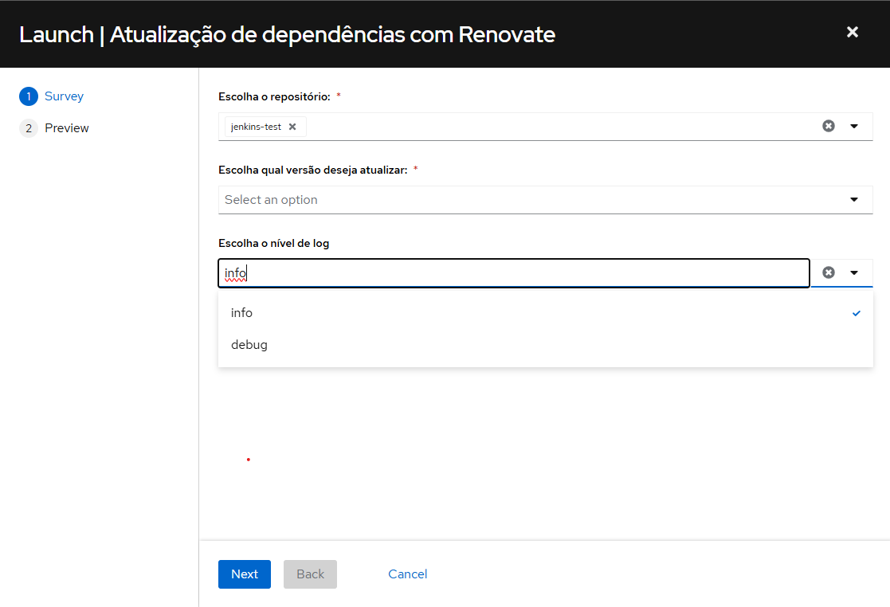
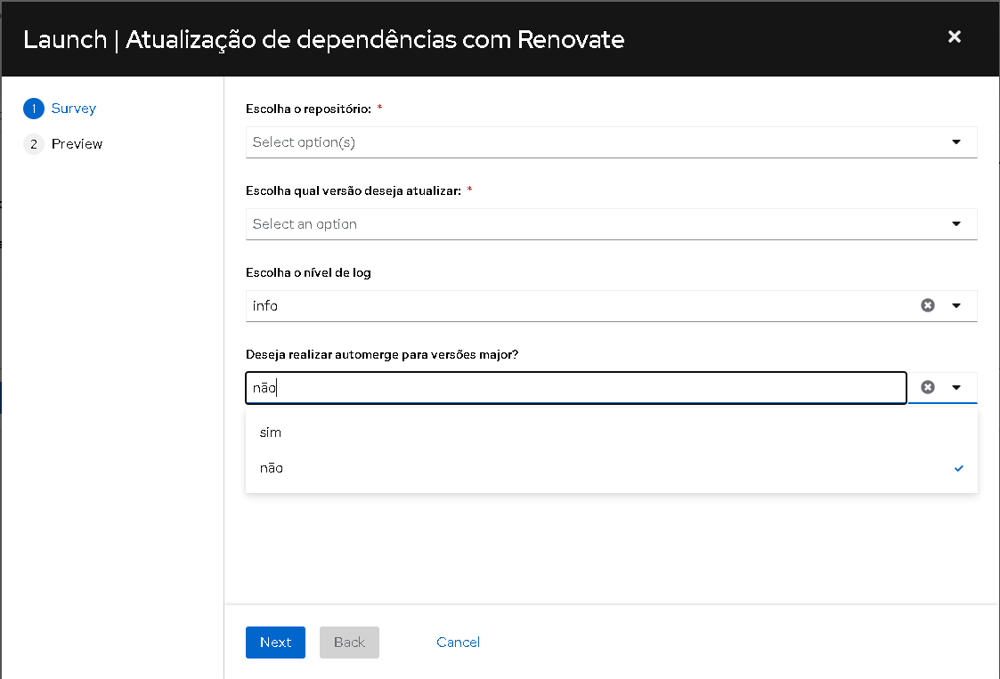

Atualização de dependências com Renovate
=========================================

Acessando o Workflow
^^^^^^^^^^^^^^^^^^^^

Para iniciar o processo, acesse o workflow ``Atualização de dependências com Renovate`` através do link:

`Atualização de dependências com Renovate <https://awx.korp.com.br/#/templates/workflow_job_template/337/details>`_

Iniciando a Execução
~~~~~~~~~~~~~~~~~~~~~

1. Clique no botão **Launch** para iniciar o processo de atualização.

2. No formulário exibido, primeiramente, escolha quais repositórios deseja acessar. É possível escolher mais de um repositório.

   .. image:: ./images/select_repos_renovate.png
      :width: 600

   .. note::
      No momento, não é possível selecionar todos os repositórios de uma só vez. No entanto, ainda é possível selecioná-los individualmente até completar todos, o que não é recomendado.

3. A seguir, escolha se deseja atualizar versões *patch* ou *major*.

   .. image:: ./images/select_version_renovate.png
      :width: 600

   .. note::
      O versionamento é feito atráves de X.Y.Z. Versões *major* incluem as versões X.Y e por padrão abrirão um pull request. Versões *patch* incluem a versão Z, e caso o PR passe por todos os testes, será feito merge automaticamente.

Configuração Personalizada com ``renovate.json``
~~~~~~~~~~~~~~~~~~~~~~~~~~~~~~~~~~~~~~~~~~~~~~~~

Além do uso do workflow via AWX, é possível configurar o comportamento do Renovate diretamente no repositório, através de um arquivo chamado ``renovate.json``, localizado na raiz do projeto na branch principal.

Esse arquivo permite definir, por exemplo, quais branches devem receber atualizações e outros comportamentos personalizados.

**Exemplo 1 - Atualizando branches específicas:**

Caso deseje que apenas determinadas branches recebam atualizações, você pode listá-las explicitamente:

.. code-block:: json

  {
    "baseBranches": ["$default", "release/2024.3.x", "release/2024.1.x"]
  }

.. important::
   Para o arquivo renovate.json ser reconhecido, ele deve estar localizado na branch default do repositório.

**Exemplo 2 - Aumentando a quantidade de branchs que serão atualizadas**

O Renovate irá atualizar a branch default (por exemplo: ``master``) e, além dela, por padrão, até 4 branches diferentes caso sejam definidas.

Se quiser delimitar o número total de branches atualizadas (incluindo a default), adicione a opção ``branchConcurrentLimit`` e altere o valor(por padrão: ``5``):

.. code-block:: json

  {
    "baseBranches": ["$default", "/^release\\/.*/"],
    "branchConcurrentLimit": 10
  }

.. note::
   Nesse exemplo, além da branch ``master``, o Renovate irá atualizar outras 9 branches de release (valores meramente ilustrativos).

Recursos Avançados e Considerações Técnicas
^^^^^^^^^^^^^^^^^^^^^^^^^^^^^^^^^^^^^^^^^^^

Esta seção é voltada para quem precisa de maior controle sobre o comportamento do Renovate ou realiza manutenção técnica no bot.

Especificações do Bot
~~~~~~~~~~~~~~~~~~~~~

.. warning::
   Por limitação do próprio Renovate, versões do ``korp.sdk`` inferiores à ``1.5.x`` não têm PRs criados nem são automaticamente mescladas ao utilizar a opção *patch*, sendo necessária intervenção manual.

* Por padrão, o bot buscará a branch principal do repositório (podendo ser ``main``, ``master``, ``config``, etc.).
* O link do job no AWX pode ser visualizado na descrição do PR criado pelo bot.
* Ao escolher a opção de atualização *major*, o Renovate prioriza sempre a versão mais recente disponível.
* Os PRs serão criados pelo usuário ``Jenkins``.
* Caso algum módulo da configuração do Renovate deixe de funcionar — seja por atualização do Ambiente de Execução do AWX ou outros fatores — recomenda-se consultar a documentação oficial para verificar se houve remoção, adição ou alteração de funcionalidades.

Nível de Log e Diagnóstico
~~~~~~~~~~~~~~~~~~~~~~~~~~

Caso necessário, é possível alterar o nível de log para ``debug`` ao iniciar o workflow. Essa opção gera uma saída mais detalhada, útil para investigações e diagnósticos.

Se os logs não forem exibidos diretamente na interface do AWX, é possível baixá-los manualmente pela própria interface, o que garante acesso completo às mensagens de saída.

Mesclagem Automática para Versões Major
~~~~~~~~~~~~~~~~~~~~~~~~~~~~~~~~~~~~~~~~

.. warning::
   Utilize esta opção com cautela. Atualizações de versão *major* podem introduzir mudanças incompatíveis e causar falhas no repositório.

É possível configurar se as atualizações de dependências com mudança de versão *major* devem ser mescladas automaticamente.  
As opções disponíveis são ``sim`` ou ``não``, sendo ``não`` a configuração padrão.

Ao selecionar ``sim``, o Renovate irá mesclar automaticamente PRs que envolvam atualizações *major*, sem intervenção manual.

