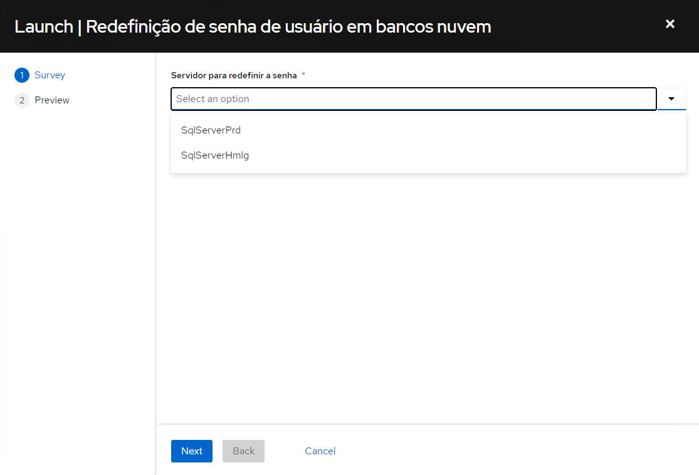

=====================================
Permissão Leitura SQL Server Produção
=====================================

Esta página fornece um passo a passo para a leitura em Base de cliente nuvem.

Concessão de permissão temporária
---------------------------------

1. No painel principal, encontre e selecione o ``Workflow Job Template`` "`Adição de permissão em banco nuvem <https://awx.korp.com.br/#/templates/workflow_job_template/90/details>`_".

2. Clique em ``Launch``

3. Seleciona o nome dos bancos que deseja obter a permissão de leitura.

4. Selecione a quantidade de horas de sua permissão.

.. note::

    É possível selecionar mais de um banco simultaneamente.

    .. image:: ./images/permissao_dbreader_2.png
        :width: 600

5. Após selecionar os bancos e quantidade de horas avançamos em ``Next``.

6. Revise as informações solicitadas e click em ``Launch``.

.. note::

    O primeiro passo do workflow é uma tarefa de aprovação. Isso significa que a execução do template só começará após ser aprovada.

Após a aprovação e execução do template, o usuário terá permissão de **leitura** nos bancos solicitados.

Acessando o banco
-----------------

O usuário de acesso ao SQL Server é o email corporativo do colaborador. Caso seja a primeira vez que você está utilizando o template, a senha de acesso será enviada para o seu email corporativo **(VERIFIQUE SUA CAIXA DE SPAM)**.

Para acessar a base, abra o SQL management studio, e configure a conexão da seguinte forma:

    - Server name: 

        - PRD: ``129.148.54.105,18169``
        - HMLG: ``150.230.69.160,18169``
    
    - Login: Email corporativo

    - Password: Senha encaminhada por email

        .. warning::

            A senha para os bancos de produção e homologação são diferentes.

    .. image:: ./images/acesso_sqlserver.png
        :width: 500

Redefinição de senha de acesso
------------------------------
1. No painel principal, encontre e selecione o ``Workflow Job Template`` "`Redefinição de senha de usuário em bancos nuvem <https://awx.korp.com.br/#/templates/workflow_job_template/196/details>`_";

2. Clique em ``Launch``;

3. Selecione o servidor em que você gostaria de redefinir a senha (PRD ou HMLG);

4. Revise as informações solicitadas e click em ``Launch``;

5. Aguarde o workflow terminar com sucesso e verifique sua caixa de email.