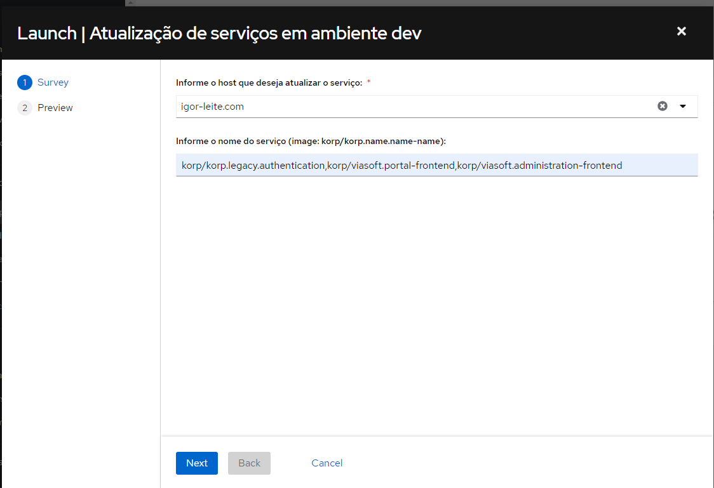

Automações para desenvolvedor
=============================

Atualização de Ambiente
-----------------------

Para realizar a atualização de um ambiente, vamos usar o ``workflow`` "`Atualização de ambiente de desenvolvedor <https://awx.korp.com.br/#/templates/workflow_job_template/263/details>`_"

#. **Host**: Selecione o host em que serão instalados os apps;

#. **Versão**: Selecione a versão para qual o ambiente será atualizado;

    .. image:: ./images/update1.png
        :width: 600

- Aguarde a execução terminar:
 
    .. image:: ./images/update2.png
        :width: 600

Instalação de aplicativos
-------------------------

Para realizar a instalação de um aplicativo em um ambiente, vamos usar o ``workflow`` "`Instalação de aplicativos em ambiente de desenvolvedor <https://awx.korp.com.br/#/templates/workflow_job_template/264/details>`_"

#. **Host**: Selecione o host em que serão instalados os apps;

#. **Apps**: Selecione um ou mais apps que serão instalados;

#. **Versão**: Selecione a versão major dos aplicativos;

    .. image:: ./images/install_app1.png
        :width: 600

- Aguarde a execução terminar:

    .. image:: ./images/install_app2.png
        :width: 600

Atualização de serviços
-----------------------

Para realizar a atualização de serviços, vamos usar o ``workflow`` "`Atualização de serviços em ambiente dev <https://awx.korp.com.br/#/templates/workflow_job_template/281/details>`_"

#. **Host**: Selecione o host que deseja atualizar serviços;

#. **Nome do serviço**: Deverá informar o nome do **repo/imagem** correspondendo ao serviço que deseja atualizar (``korp/korp.name.name-name``);
   
   * Em caso de mais de um serviço, os nomes devem ser separados por ``,`` e sem espaços 
   * exemplo: ``korp/korp.name.name-name1,korp/korp.name.name-name2``.

  .. note::
    
   * Caso não passe nenhum serviço será feita uma varredura em **todos serviços** existentes no ambiente e atualizados caso exista atualizações disponíveis.

Para obter mais detalhes sobre os logs da atualização acesse o portainer em ``http://<host>.com:9011/#!/2/docker/containers`` procure pelo container do ``watchtower`` e ``logs``.

.. note::
    #. Em todos os casos, sempre execute o template do tipo ``Workflow job template``;
