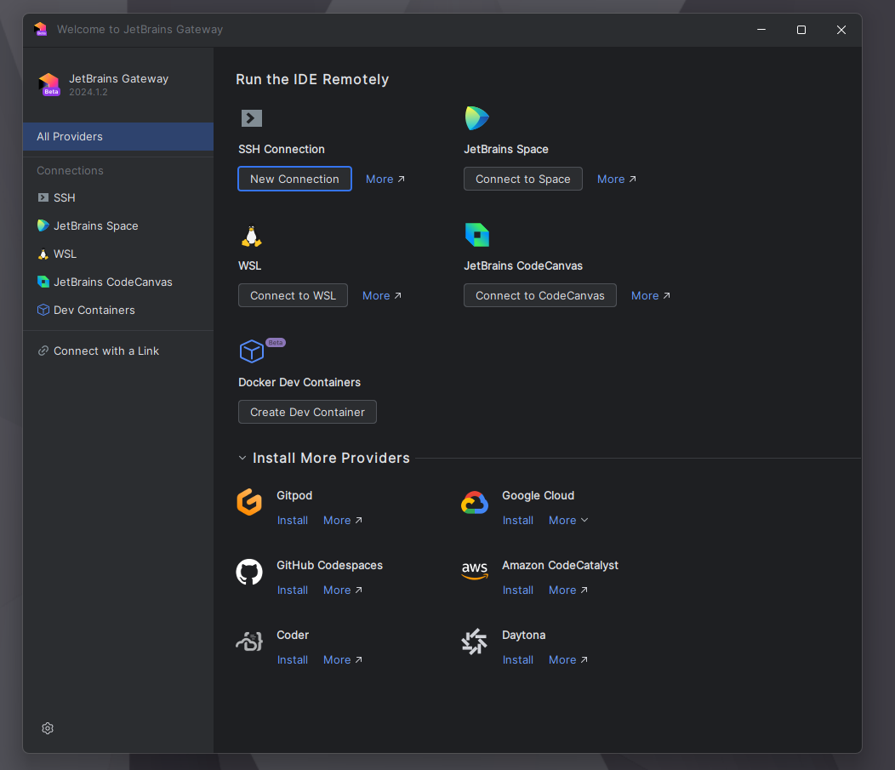
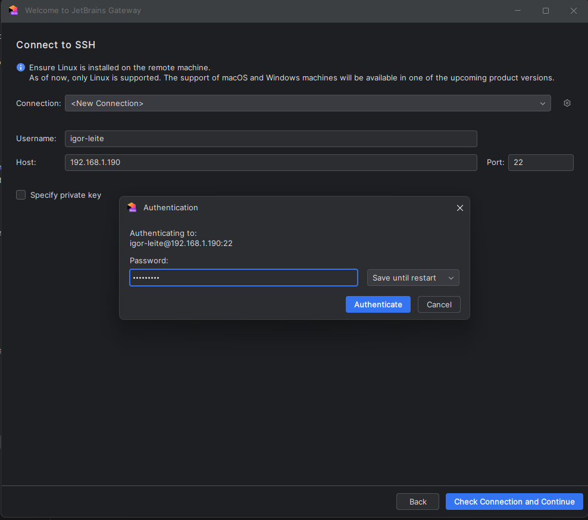
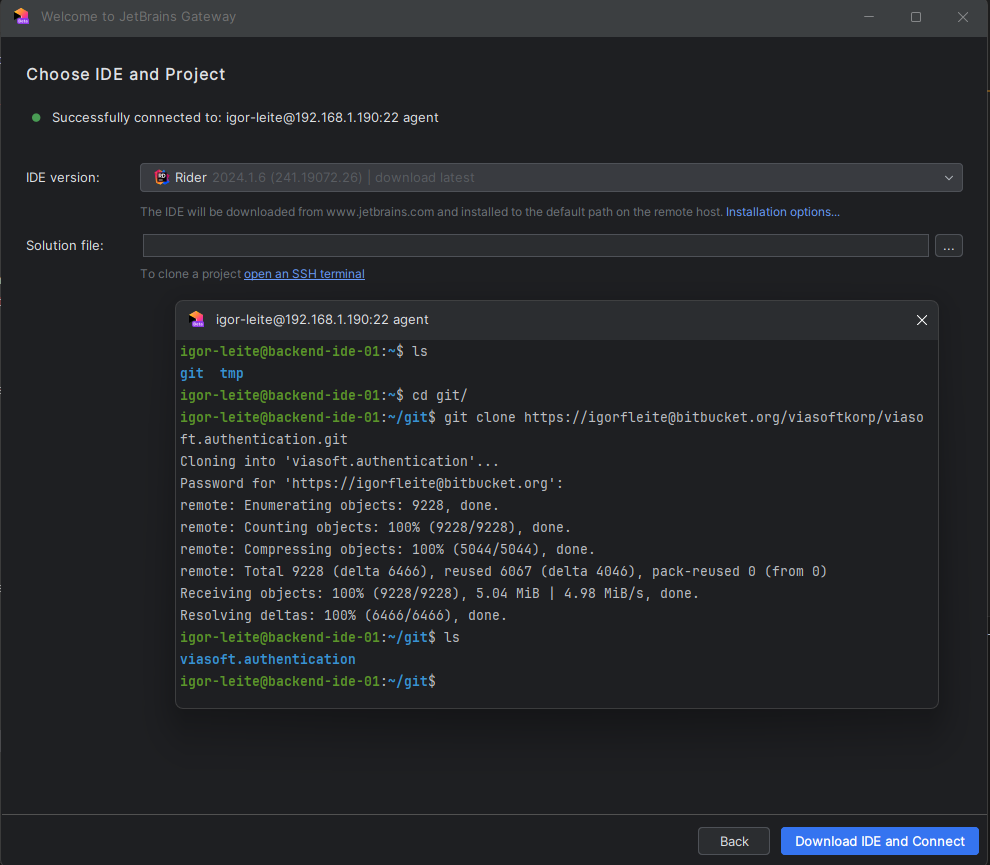
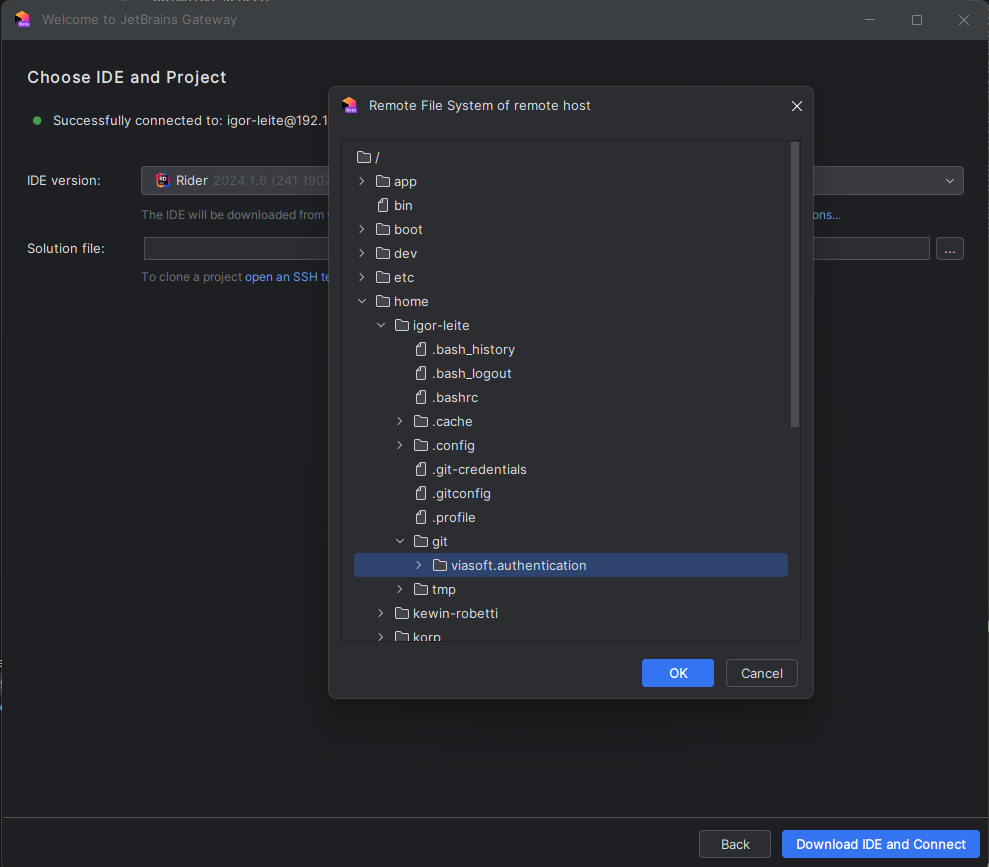
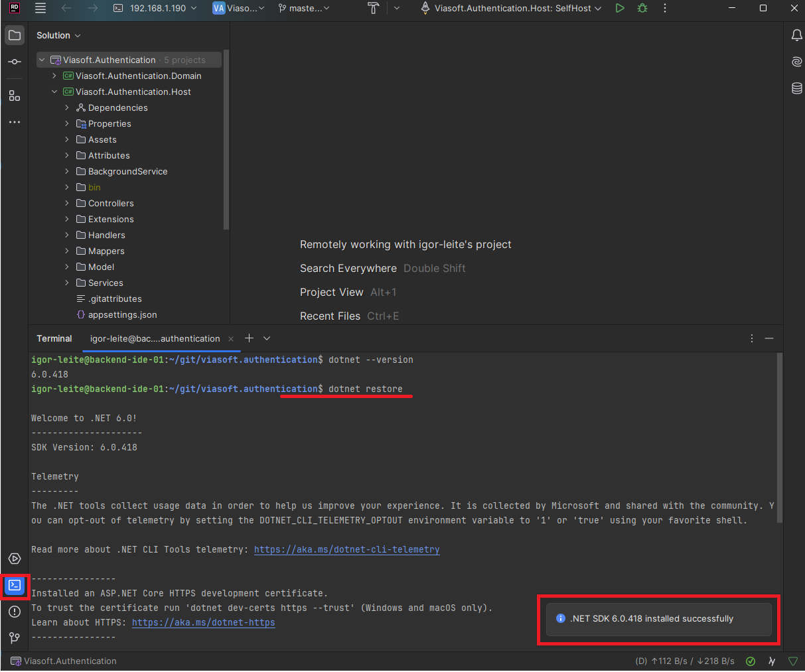
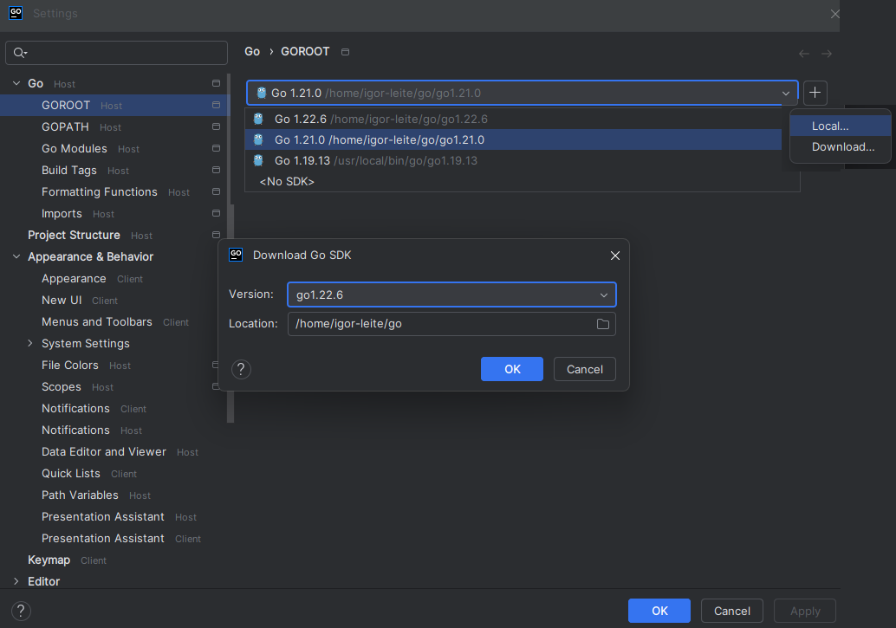
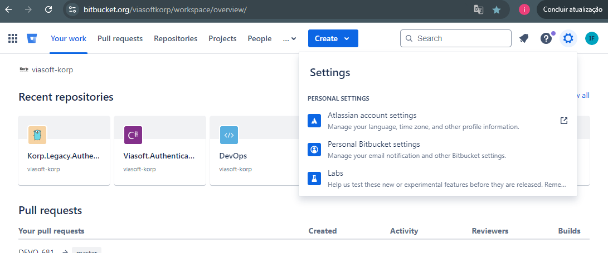
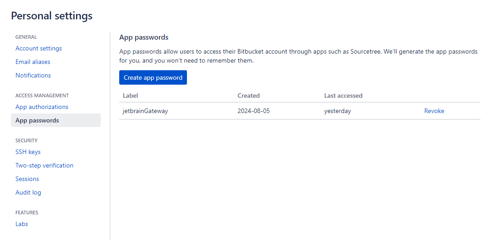
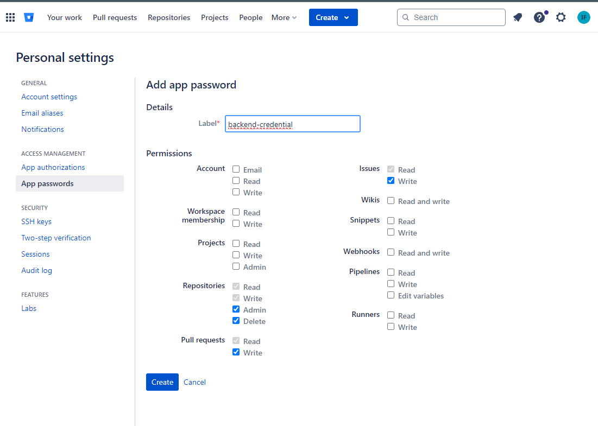

JetBrains Gateway
------------

Faça o download e instalação do `JetBrains Gateway <https://www.jetbrains.com/pt-br/remote-development/gateway/>`_.

Primeiro Acesso
===============

.. warning:: 
  Para utilizar o **JetBrains Gateway** será necessário:
    - Crendeciais git, veja o tópico `Credenciais Git`_ .
    - Logar com a conta JetBrains na **máquina que utilizará** o gateway para validar licenças.

1. Abra o **JetBrains Gateway** > **SSH** > **New Connection**

2. Realizando a conexão, preencha com seu **username** e **host** para conectar.
   
 - Host     -> dns/ip do host que rodará o backend da IDE 
 
 Infome a senha do usuário > **Authenticate** > **Check Connection and Continue**

3. Faça o clone do projeto que deseja abrir e selecione a IDE. (necessário `Credenciais Git`_ )

.. warning::
   O link de clone do repositório deve ser feito via **HTTPS** . 

- **Escolha a IDE** para download ou start.
- Clique em **To clone a project open an SSH terminal** para clonar projeto.
- Entre no dir ``~/git``, clone o repositório desejado e informe o password para autenticação git.

.. note::
    - É aconselhavel usar o diretório ``~/git`` para organização dos projetos.
    - A credencial git ficará salva em ``.gitconfig`` / ``.git-credentials``.

1. Selecione o projeto clonado em **Solution file** > **...** depois **OK** > **Download IDE and Connect** ou **Start and Connect**

Pronto, aguarde até a IDE iniciar.

Gerenciamento de Versões
========================

.NET
####

1. A IDE detectará qual versão o projeto utiliza e realizará o download automaticamente.

.. note::
   A IDE cria e gerencia o download das versões em ``~/.dotnet``

2. Abra o terminal e execute ``dotnet restore`` para restaurar as dependências.

Golang
######

.. note::
    - Versão padrão **go1.19**
    - Esse versão é padrão para **todos usuários**, qualquer outra versão será gerenciada diretamente pelo usuário.

1. Na IDE do Goland, no menu superior: **File** > **Settings** > **GO** > **GOROOT** 

   * Podemos realizar o download da versão desejada.
   * Podemos escolher / alternar entre versões existentes. 

.. _credenciais-git:
Credenciais Git
===============

1. Acesse a página inicial do bitbucket, no menu superior direito vá em **Settings > Personal Bitbucket settigns**.

2. Em **App passwords** > **Create app password**.

3. De um nome para sua credencial, marque as permissões necessárias e crie.

.. warning::
    Após criada, **copie e guarde** o password gerado, ela **não será mostrado novamente**.

