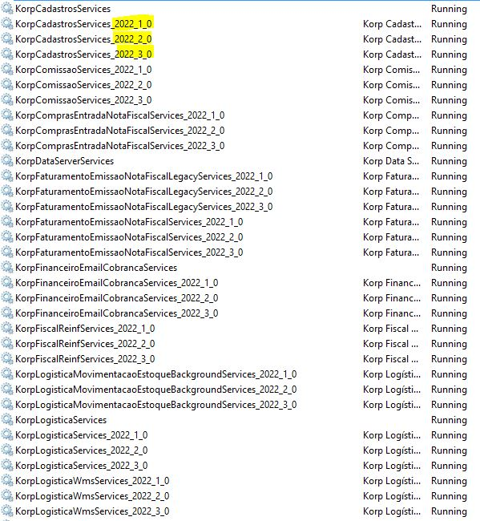

Instalação de nova versão dos serviços Delphi
=============================================

Os serviços Delphi deverão ser instalados em cada liberação de versão maior, não sendo necessário a execução do instalador entre builds porque eles se auto-atualizam de madrugada.

----

Como instalar uma versão nova
#############################

* Acessar a área do cliente e baixar o instalador

    O instalador da versão sempre terá o seguinte padrão no nome KorpSetup_Installer_VERSÃO.exe

* Acessar a máquina ``services``, IP 144.22.132.196
* Executar o instalador, **não marcar a opção Desinstalar versões anteriores**

----

Como verificar os logs de instalação
####################################

* Os logs de uma instalação estão na pasta ``C:\ProgramData\Korp\VERSÃO\Log\KorpSetup.log``

----

Como verificar se a versão X está instalada?
############################################

* Acessar a máquina ``services``, IP 144.22.132.196
* Abrir os serviços do Windows
* Apertar a letra `k` (para se posicionar nos serviços que começam com Korp)
* Localizar os serviços que começam com `Korp`
* Os serviços da versão X deverão estar listados, a versão está no sufixo do nome do serviço

