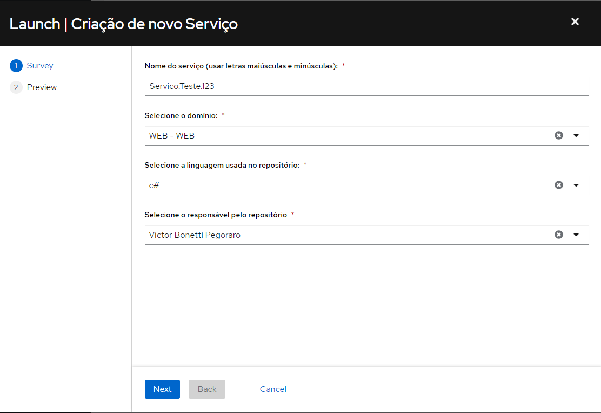
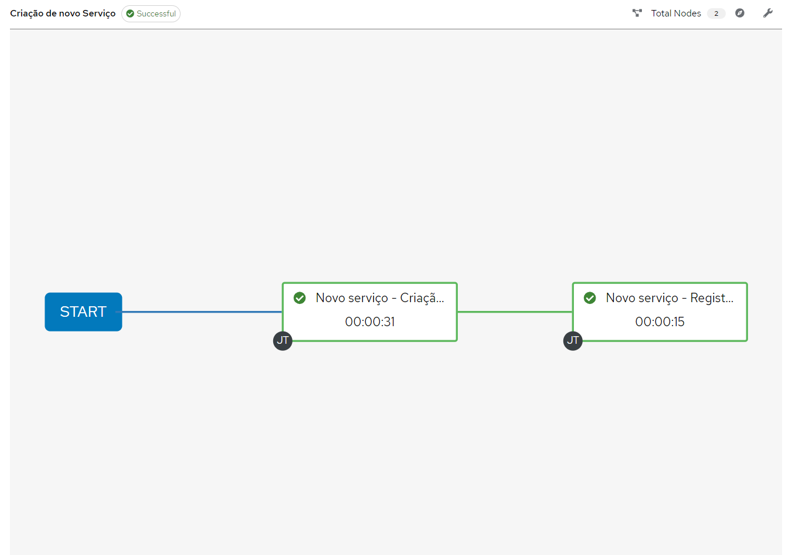

Criação de novo serviço
=======================
Informações
-----------

Para criar um repositório para novo serviço com as configurações necessárias, será necessário rodar o workflow "`Criação de novo serviço <https://awx.korp.com.br/#/templates/workflow_job_template/233/details>`_".

.. note::
    O Workflow irá:

    - Criar Repositório no BitBucket
    - Criar Job no Jenkins
    - Registrar repositório no serviço GitFetcher

Execução
--------

Acessar o AWX e executar o template 'Criação de Serviço'. Será necessário fornecer as seguintes informações:

#. **Nome do serviço**: Nome atribuído ao repositório do serviço. Usar letras maiúsculas e minúsculas;

#. **Domínio**: O Domínio/Projeto em que o serviço será incluído;

#. **Linguagem**: A linguagem usada no repositório; 

#. **Responsável**: Usuário responsável pelo repositório; 

Acompanhe a execução do workflow para garantir que todos os passos foram bem-sucedidos;

