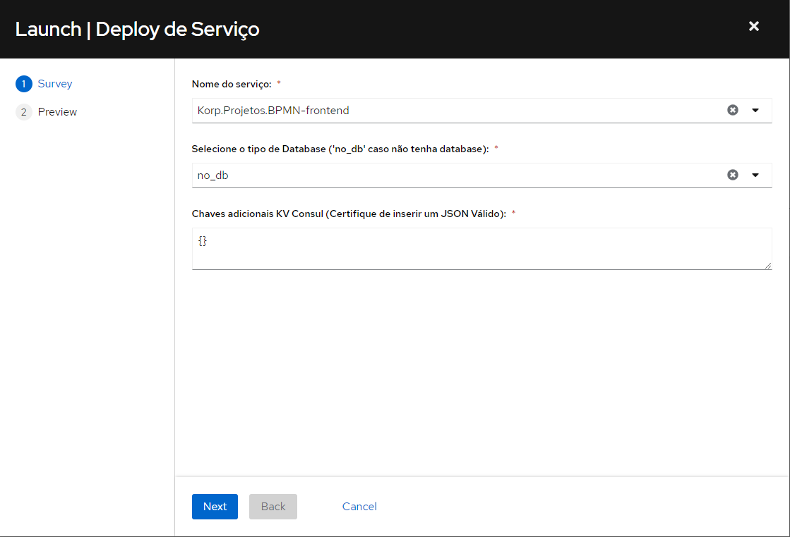

Deploy de serviço
=================

Informações
-----------

Para fazer todas as configurações necessárias para o novo serviço, será necessário rodar o workflow "`Deploy de serviço <https://awx.korp.com.br/#/templates/workflow_job_template/236/details>`_";

- Deve ser executado após o serviço ser criado com o workflow ``Criação de novo serviço``;

.. note::
    O Workflow irá:

    - Criar Cliente OAuth
    - Registrar serviço no repositório IAC 
    - Criar e configurar Banco de dados, se necessário
    - Configurar Connection String, se necessário
    - Configurar Consul

Execução
--------

Acessar o AWX e executar o template ``Deploy de serviço``. Será necessário fornecer as seguintes informações:

#. **Nome do serviço**: Selecione o repositório em que será feito o deploy;

#. **Chaves adicionais KV Consul (JSON)**: Chaves/Valor do consul, que sejam diferentes de ``'Authentication'`` e ``'Connection String'`` (essas são preenchidas automáticamente pelo workflow). Ao adicionar chaves adicionais, certifique-se de inserir um JSON válido. Caso não haja, mantenha o valor padrão ``{}``;

#. **Tipo de database**: Escolha o tipo de database do serviço. Caso não tenha database, selecione ``no_db``; 

Acompanhe a execução do workflow para garantir que todos os passos foram bem-sucedidos;

.. note::
    Além de executar o Deploy pelo AWX é necessário:
    - Adicionar Serviço ao seu devido compose no repositório korp-iac (https://bitbucket.org/viasoftkorp/korp-iac/src/master/Oracle/)
    - Adicionar serviço a sua devida role no setup de cliente Onpremise (https://github.com/viasoftkorp/KorpSetupLinux)
    - Adicionar serviço a sua devida role no setup de desenvolvedor (https://github.com/viasoftkorp/infrastructure-setup-dev)