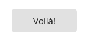
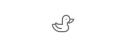
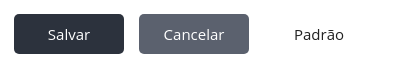
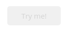

.. role:: raw-html-m2r(raw)
   :format: html

Button
======

``<vs-button>`` é o componente de botão responsável por padronizar ações, apresentando vários estilos diferentes mas mantendo o padrão visual.

----

Exemplos
========

Utilização básica
-----------------

Utilizar o ``<vs-button>`` é simples, basta colocar a tag em seu template com algum texto dentro e...

.. code-block:: html

   <vs-button>Voilà!</vs-button>

... um botão.

Estilo
------

Para mudar o estilo do botão, a propriedade ``model`` é utilizada da seguinte maneira:

.. code-block:: html

   <vs-button model="<MODEL>">Botão</vs-button>

Onde ``<MODEL>`` pode ser um dos seguintes valores:

.. list-table::
   :header-rows: 1

   * - Estilo
     - Resultado
   * - ``icon``
     - 
     .. image:: ./assets/icon.png
        :target: ./assets/icon.png
        :alt: Icon <vs-button>
     
   * - ``raised``
     - 
     .. image:: ./assets/raised.png
        :target: ./assets/raised.png
        :alt: Raised <vs-button>
     
   * - ``basic``
     - 
     .. image:: ./assets/basic.png
        :target: ./assets/basic.png
        :alt: Basic <vs-button>
     
   * - ``stroked``
     - 
     .. image:: ./assets/stroked.png
        :target: ./assets/stroked.png
        :alt: Stroked <vs-button>
     
   * - ``fab``
     - 
     .. image:: ./assets/fab.png
        :target: ./assets/fab.png
        :alt: FAB <vs-button>
     
   * - ``mini_fab``
     - 
     .. image:: ./assets/mini_fab.png
        :target: ./assets/mini_fab.png
        :alt: Mini FAB <vs-button>
     
   * - ``flat`` (padrão)
     - 
     .. image:: ./assets/flat.png
        :target: ./assets/flat.png
        :alt: Flat <vs-button>
     

Ícone
^^^^^

Para o estilo de ícone, a propriedade ``icon`` deve receber um nome de ícone do `FontAwesome <https://fontawesome.com/icons?d=gallery&s=light>`_\ :

.. code-block:: html

   <vs-button model="icon" icon="duck"></vs-button>

Tipo
----

Um botão geralmente tem alguma função ligada a ele, seja ela de salvar, cancelar, ou outra. Para os casos de salvar ou cancelar, a propriedade ``type`` deve ser ajustada para ``save`` ou ``cancel``\ , respectivamente. Caso a propriedade não seja definida, ela tomará o valor de ``default``.

Os três tipos de botão são demonstrados a seguir:

.. code-block:: html

   <vs-button type="save">Salvar</vs-button>
   <vs-button type="cancel">Cancelar</vs-button>
   <vs-button>Padrão</vs-button>

Cor
---

A propriedade ``color`` pode ser utilizada para escolher entre as cores ``'primary'``\ , ``'accent'`` ou ``'default'``.

Botão desativado
----------------

Para desativar um botão, deve-se trocar a propriedade ``disabled`` para ``true``\ :

.. code-block:: html

   <vs-button [disabled]="true">Try me!</vs-button>

Tooltips
--------

Ver `Tooltips <./../api#tooltips>`_

----

API
===

VsButtonModule
--------------

``import { VsButtonModule } from '@viasoft/components/button';``

VsButtonComponent
-----------------

Inputs
^^^^^^

.. list-table::
   :header-rows: 1

   * - Nome
     - Descrição
     - Tipo
     - Valor padrão
   * - ``model``
     - Estilo do botão
     - ``icon`` | ``raised`` | ``basic`` | ``stroked`` | ``fab`` | ``mini_fab`` | ``flat``
     - ``flat``
   * - ``classes``
     - Classes de CSS a serem aplicadas ao botão (separadas por espaço)
     - ``string``
     - 
   * - ``type``
     - Tipo do botão
     - ``default`` | ``save`` | ``cancel``
     - ``default``
   * - ``disabled``
     - Define se o botão não deve ser clicável
     - ``boolean``
     - ``false``
   * - ``tooltip``
     - Texto a ser mostrado no balão de dica\ :raw-html-m2r:`[[2]](#anotacoes)` (mostrado ao passar o mouse sobre o texto)
     - ``string``
     - 
   * - ``tooltipPosition``
     - Posição do balão de dica
     - ``above`` | ``below`` | ``left`` | ``right`` | ``before`` | ``after``
     - ``below``
   * - ``label``
     - Texto a ser mostrado no botão\ :raw-html-m2r:`[[2]](#anotacoes)`
     - ``string``
     - 
   * - ``icon``
     - Ícone a ser mostrado no botão caso ``model`` seja igual a ``icon``
     - ``string``

Outputs
^^^^^^^

.. list-table::
   :header-rows: 1

   * - Nome
     - Descrição
     - Tipo
   * - ``clickEvent``
     - Evento acionado quando o botão é clicado
     - ``EventEmitter<any>``

----

:raw-html-m2r:`<b id="anotacoes">Anotações</b>`

#. Deve ser um código de cor hexadecimal.
#. Caso o texto seja uma chave de tradução, o mesmo será traduzido automaticamente.
