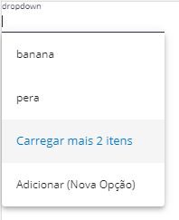
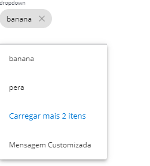

.. role:: raw-html-m2r(raw)
   :format: html

Dropdown
========

O componente de dropdown do SDK é utilizado com a diretiva ``<vs-dropdown>``\ , ele é utilizado com autocomplete, possui algumas combinações para cada opção do dropdown, lazy loading por meio de tamanho máximo das opções mostradas, e a possibilidade de modo chip.

Deve ser utilizado em lugares onde além de uma seleção de opção é necessário um filtro para tais opções, ou onde é necessário multiplas opções.

----

Exemplos
========

Simples
-------

.. code-block:: html

     <vs-dropdown controlName="drop" placeholder="dropdown" [dropSize]="getInput" [options]="dropOptions"></vs-dropdown>

.. code-block:: ts

   import { VsDropDown, VsDropDownGet, VsDropDownGetInput } from './dropdown/dropdown';
   // ...

   @Component( /* ... */ )
   export class MyComponent implements OnInit {

       dropOptions: VsDropDownGet;
       getInput: VsDropDownGetInput;
       situationFieldOptions: VsDropDown = {
           totalCount: 4,
           items: [
               { label: 'banana' },
               { label: 'pera' },
               { label: 'maça' },
               { label: 'abacaxi' }
           ]
       };

       ngOnInit() {
           this.getInput = {
               maxDropSize: 2
           };

           this.dropOptions = new VsDropDownGet();

           this.dropOptions.chipMode = false;

           this.dropOptions.customActionCallBack = () => this.custom();

           this.dropOptions.get = (input: VsDropDownGetInput) =>
               this.getDrop(this.getInput);
       }

       getDrop(input) {
           return of(this.situationFieldOptions);
       }

       custom() {
           return of(alert('opção customizada'));
       }
   }

Chips
-----

.. code-block:: html

     <vs-dropdown controlName="drop" placeholder="dropdown" [dropSize]="getInput" [options]="dropOptions"></vs-dropdown>

.. code-block:: ts

   import { VsDropDown, VsDropDownGet, VsDropDownGetInput } from './dropdown/dropdown';
   // ...

   @Component( /* ... */ )
   export class MyComponent implements OnInit {

       dropOptions: VsDropDownGet;
       getInput: VsDropDownGetInput;
       situationFieldOptions: VsDropDown = {
           totalCount: 4,
           items: [
               { label: 'banana' },
               { label: 'pera' },
               { label: 'maça' },
               { label: 'abacaxi' }
           ]
       };

       ngOnInit() {
           this.getInput = {
               maxDropSize: 2
           };

           this.dropOptions = new VsDropDownGet();

           this.dropOptions.chipMode = true;

           this.dropOptions.customActionCallBack = () => this.custom();

           this.teste.customActionMessage = 'Mensagem Customizada';

           this.dropOptions.get = (input: VsDropDownGetInput) =>
               this.getDrop(this.getInput);
       }

       getDrop(input) {
           return of(this.situationFieldOptions);
       }

       custom() {
           return of(alert('opção customizada'));
       }
   }

----

API
===

``import { VsDropdownModule } from '@viasoft/components/dropdown';``

Propriedades
------------

.. list-table::
   :header-rows: 1

   * - Nome
     - Valores
     - Descrição
   * - **Inputs**
     - 
     - 
   * - @Input() options
     - ``<``\ `\ ``VsDropDownGet`` <#vsdropdownget>`_\ ``>``
     - As opções do dropdown são definidas por está propriedade por meio de um callback.
   * - @Input() dropSize
     - ``<``\ `\ ``VsDropDownGetInput`` <#vsdropdowngetinput>`_\ ``>``
     - Define o lazyload do dropdowne valor do filtro.
   * - @Input() placeholder
     - string
     - 
   * - @Input() customInput
     - any
     - Serve para receber valor quando é definido uma opção customizada.
   * - @Input() controlName
     - string
     - Define o nome de controle do componente.

VsDropDownGet
-------------

``<``\ `\ ``VsDropDownGet`` <#vsdropdownget>`_\ ``>``

Propriedades
^^^^^^^^^^^^

.. list-table::
   :header-rows: 1

   * - Nome
     - Valores
     - Descrição
   * - customActionMessage
     - string
     - Aceita uma mensagem customizada para utilizar opção customizada.
   * - chipMode
     - boolean
     - Serve para utilizar o modo de chip ou não.
   * - disabled
     - boolean
     - Define se o componente está habilitado ou não.
   * - cleanable
     - boolean
     - Define se o componente contém icone para clean para os modos.
   * - required
     - boolean
     - Define se o dropdown tem formulário requerido.
   * - enableMultipleChipSelection
     - boolean
     - Define se uma opção com mesmo nome pode ser selecionada mais de uma vez.
   * - enableCustomSelection
     - boolean
     - Define uma opção não pertencente a lista pode ser selecionada.
   * - tooltip
     - string
     - Define a mensagem do tooltip.
   * - tooltipPosition
     - string
     - Define a posição do tooltip. 'above', 'below', 'left', 'right', 'before', 'after'

Callbacks
^^^^^^^^^

Os callbacks são utilizados para utilização do componentes, atualização de dados em suma.

.. list-table::
   :header-rows: 1

   * - Nome
     - Descrição
   * - **get** : (input: ``<``\ `\ ``VsDropDownGetInput`` <#vsdropdowngetinput>`_\ ``>`` ) => Observable\ :raw-html-m2r:`<any>`
     - É requerido ao inciar o componente para sua carga de dados, é utilizado internamente para as consultas.
   * - **customActionCallBack** : (data: any) => Observable\ :raw-html-m2r:`<any>`
     - É utilizado quando necessário uma opção extra que pode disparar um evento qualquer na aplicação, com isto pode aceitar um dado que é chamado pela propriedade customInput do dropdown.

VsDropDownGetInput
------------------

VsDropDownGetInput é utilizado para o CallBack de ``get`` do  ``VsDropDownGet`` e retorna informações de filtro para manipulação dos dados dentro do CallBack.

Propriedades
^^^^^^^^^^^^

.. list-table::
   :header-rows: 1

   * - Nome
     - Descrição
     - Type
   * - maxDropSize
     - O tamanho máximo de informações que seram carregadas na primeira chamada do dropdown.
     - number
   * - valueToFilter
     - Este é um valor utilizado interno, para fitlro por parte do autocomplete, mas pode ser utilizado para filtrar algo específico na chamada.
     - string
   * - skipCount
     - Indica valores que serão ignoras quando uma nova chamada for feito para carga de mais dados do dropdown.
     - number
     - 

