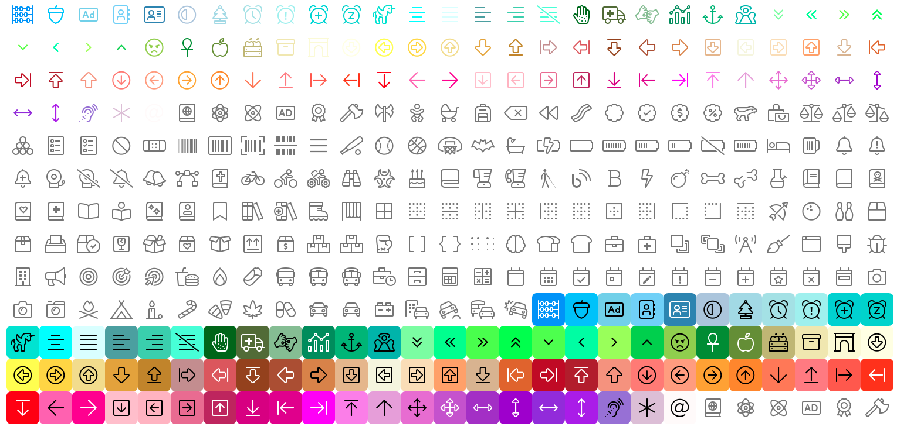
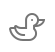
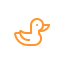
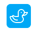

.. role:: raw-html-m2r(raw)
   :format: html

Icon
====

``<vs-icon>`` é um componente básico, responsável por mostrar ícones.

----

Exemplos
========

Utilização básica
-----------------

Pra utilizar o ``<vs-icon>``\ , basta passar o nome do ícone na propriedade ``icon``\ :

.. code-block:: html

   <vs-icon icon="duck"></vs-icon>

Resultado:

Cor
---

Ícone
^^^^^

A cor do ícone pode ser alterada pela propriedade ``color``\ :

.. code-block:: html

   <vs-icon icon="duck" color="#fc9905"></vs-icon>

Resultado:

Fundo
^^^^^

A cor do fundo do ícone pode ser alterada pela propriedade ``boxColor``\ :

.. code-block:: html

   <vs-icon icon="duck" boxColor="#fc9905"></vs-icon>

Resultado:

A cor do ícone se adapta automaticamente ao fundo.

Tamanho
-------

Se o ícone estiver acompanhado de um `\ ``<vs-label>`` <./../label/>`_\ , a propriedade ``model`` deve ser alterada para combinar com a do ícone.

----

API
===

VsIconModule
------------

``import { VsIconModule } from '@viasoft/components/icon';``

VsIconComponent
---------------

Inputs
^^^^^^

.. list-table::
   :header-rows: 1

   * - Nome
     - Descrição
     - Tipo
     - Valor padrão
   * - ``icon``
     - Nome do ícone a ser utilizado
     - ``string``
     - 
   * - ``iconType``
     - Tipo do ícone (\ `FontAwesome <https://fontawesome.com/icons?d=gallery&s=light>`_ ou `Material <https://material.io/resources/icons/?style=baseline>`_\ )
     - ``fa`` | ``mat``
     - ``fa``
   * - ``color``
     - Cor do ícone\ :raw-html-m2r:`[[1]](#anotacoes)`
     - ``string``
     - 
   * - ``boxColor``
     - Cor do fundo do ícone\ :raw-html-m2r:`[[1]](#anotacoes)`
     - ``string``
     - 
   * - ``classes``
     - Classes de CSS a serem aplicadas ao ícone
     - ``string``
     - 
   * - ``margin``
     - Margem extra a ser aplicada ao ícone\ :raw-html-m2r:`[[2]](#anotacoes)`
     - ``string``
     - 
   * - ``model``
     - Tamanho do ícone (se acompanhado de um `\ ``<vs-label>`` <./../../label/>`_\ , deve ser igual)
     - ``main_title`` | ``title`` | ``sub_title`` | ``aux_title`` | ``small_title`` | ``extra_title`` | ``text`` | ``label`` | ``link`` | ``error`` | ``default_icon``
     - ``default_icon``
   * - ``tooltip``
     - Texto a ser mostrado no balão de dica\ :raw-html-m2r:`[[3]](#anotacoes)` (mostrado ao passar o mouse sobre o ícone)
     - ``string``
     - 
   * - ``tooltipPosition``
     - Posição do balão de dica
     - ``above`` | ``below`` | ``left`` | ``right`` | ``before`` | ``after``
     - ``below``

----

:raw-html-m2r:`<b id="anotacoes">Anotações</b>`

#. Deve ser um código de cor hexadecimal.
#. Deve ser um valor de margem CSS válida (\ `referência MDN <https://developer.mozilla.org/en-US/docs/Web/CSS/margin>`_\ ).
#. Caso o texto seja uma chave de tradução, o mesmo será traduzido automaticamente.
