.. role:: raw-html-m2r(raw)
   :format: html

Input
=====

:raw-html-m2r:`Esta página está incompleta.`

``<vs-input>`` é um componente de campo de texto utilizado em formulários. Além das funcionalidades padrão de um elemento de formulário, conta com máscaras básicas e avançadas, prefixos e sufixos, textos de dica e erro, entre outras funcionalidades.

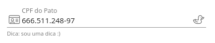

----

Exemplos
========

Utilização Básica
-----------------

O ``<vs-input>`` funciona como um elemento de formulário qualquer, ou seja, pode ser utilizado com formulários padrão do Angular (\ ``ngModel``\ ) ou com Reactive Forms. Para aprender sobre Reactive Forms, consulte a documentação oficial do Angular sobre `Forms <https://angular.io/guide/reactive-forms>`_.

Em todos os exemplos mostrados, presuma que a seguinte estrutura está presente, porém omitida:

.. code-block:: html

   <form [formGroup]="form">
     <!-- Código do exemplo -->
   </form>

Placeholder
-----------

O placeholder de um campo é o texto mostrado no lugar do conteúdo quando o campo está vazio ou, caso não esteja vazio, acima do conteúdo. Para alterar o placeholder, utilize a propriedade ``placeholder``\ :

.. code-block:: html

   <vs-input
       formControlName="controlName"
       placeholder="Placeholder demo"
   ></vs-input>

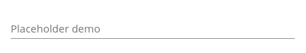

Dica
----

Para mostrar uma mensagem de dica abaixo de um ``<vs-input>``\ , atribua um texto à propriedade ``hintLabel``\ :

.. code-block:: html

   <vs-input
       formControlName="controlName"
       placeholder="Hint demo"
       hintLabel="Texto de dica :)"
   ></vs-input>

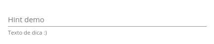

Mensagem de Erro
----------------

Quando um ``<vs-input>`` apresentar algum erro de validação, uma mensagem em vermelho será mostrada abaixo dele. Para alterar essa mensagem, atribua um texto à propriedade ``errorMessage``\ :

.. code-block:: html

   <vs-input
       formControlName="controlName"
       placeholder="Error demo"
       errorMessage="Oops!"
   ></vs-input>

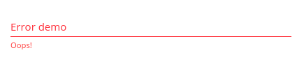

Campo numérico
--------------

Alterando a propriedade ``type`` para ``number``\ , o campo passa a aceitar somente números:

.. code-block:: html

   <vs-input
       formControlName="controlName"
       placeholder="Number demo"
       type="number"
   ></vs-input>

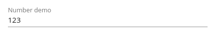

Máscaras
--------

A propriedade ``mask`` aplica uma máscara ao campo. Para mais informações e detalhes de opções de cada uma das máscaras abaixo, consulte a `API <./index.rst>`_.

Uma máscara pré-definida pode ser utilizada como ``string`` ou ``VsMask``\ :

.. code-block:: ts

   mask = 'phone';

   // É equilavente a...

   mask = <VsMask>{
     type: 'phone',
     options: {
       // Dependente do tipo da máscara
     }
   };

Uma máscara personalizada deve ser definida da seguinte maneira:

.. code-block:: ts

   mask = <VsMask>{
     type: 'custom',
     imask: {
       // Objeto de máscara compatível com imaskjs
     }
   }

A documentação do imask pode ser encontrada `aqui <https://imask.js.org/>`_.

Moeda
^^^^^

A máscara ``currency`` formata o campo como moeda:

.. code-block:: html

   <vs-input
       formControlName="controlName"
       placeholder="Currency demo"
       mask="currency"
   >
       R$
   </vs-input>

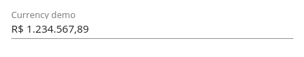

CPF e CNPJ
^^^^^^^^^^

A máscara ``cnpj-cpf`` formata e validam CNPJs, CPFs ou ambos.

Telefone e Celular
^^^^^^^^^^^^^^^^^^

A máscara ``phone`` formata o conteúdo do campo como números de telefone de 8 dígitos (+DDD), 9 dígitos (+DDD) ou ambos.

CEP
^^^

A máscara ``zipcode`` formata o conteúdo do campo como CEP.

Atributos
---------

Disabled e read-only
^^^^^^^^^^^^^^^^^^^^

Para desativar a utilização de um campo, existem duas opcões: ``disabled`` e ``readonly``. Ambas as propriedades desabilitam a edição do conteúdo, mas ``disabled`` muda a aparência do campo, enquanto ``readonly`` mantém-o com a mesma aparência.

.. code-block:: html

   <vs-input
       formControlName="controlName"
       placeholder="Disabled demo"
   ></vs-input>

   <vs-input
       formControlName="controlNameTwo"
       placeholder="Read-only demo"
       [readonly]="true"
   ></vs-input>

.. code-block:: ts

   this.form.get('controlName').disable();

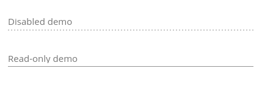

Required
^^^^^^^^

Para que um campo seja obrigatório, deve-se alterar a propriedade ``required``\ :

.. code-block:: html

   <vs-input
       formControlName="controlName"
       placeholder="Required demo"
       [required]="true"
   ></vs-input>

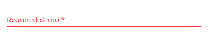

Hidden
^^^^^^

Para esconder um ``<vs-input>``\ , altere a propriedade ``hidden`` para ``true``.

Foco
----

Para que um ``<vs-input>`` receba foco automaticamente, deve-se alterar a propriedade ``toFocus``\ :

.. code-block:: html

   <vs-input
       formControlName="controlName"
       placeholder="Focus demo"
       [toFocus]="true"
   ></vs-input>

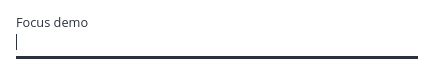

Prefixo e Sufixo
----------------

Prefixos e sufixos são ícones ou texto que aparecem antes e depois do conteúdo do campo, respectivamente.

Texto
^^^^^

Para utilizar um prefixo ou sufixo de texto, deve-se utilizar os seletores ``prefix`` ou ``suffix``\ :

.. code-block:: html

   <vs-input
       formControlName="controlName"
       placeholder="Prefix demo"
   >
       $
   </vs-input>

   <vs-input
       formControlName="controlName"
       placeholder="Suffix demo"
   >
       %
   </vs-input>

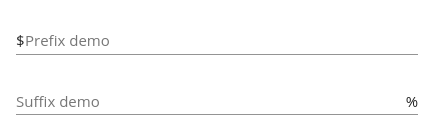

Ícone
^^^^^

Para utilizar um prefixo ou sufixo de ícone, deve-se utilizar as propriedades ``iconPrefix`` ou ``iconSuffix``\ :

.. code-block:: html

   <vs-input
       formControlName="controlName"
       placeholder="Prefix demo"
       iconPrefix="duck"
   ></vs-input>

   <vs-input
       formControlName="controlName"
       placeholder="Suffix demo"
       iconSuffix="dove"
   ></vs-input>

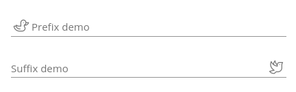

Evento de clique
^^^^^^^^^^^^^^^^

Para tornar um prefixo ou sufixo clicável, deve-se alterar as propriedades ``isPrefixClickable`` ou ``isSuffixClickable`` e passar uma função aos outputs ``prefixClickEvent`` ou ``suffixClickEvent``\ :

.. code-block:: html

   <vs-input
       formControlName="controlName"
       placeholder="Prefix demo"
       iconPrefix="duck"
       [isPrefixClickable]="true"
       (prefixClickEvent)="myFunction()"
   ></vs-input>

   <vs-input
       formControlName="controlName"
       placeholder="Suffix demo"
       iconSuffix="dove"
       [isSuffixClickable]="true"
       (suffixClickEvent)="myFunction()"
   ></vs-input>

Tooltips
--------

Ver `Tooltips <./../../api#tooltips>`_

API
===

VsInputModule
-------------

``import { VsInputModule } from '@viasoft/components/input';``

VsInputComponent
----------------

Inputs
^^^^^^

.. list-table::
   :header-rows: 1

   * - Nome
     - Descrição
     - Tipo
     - Valor padrão
   * - ``formControlName``
     - Nome do FormControl do input em seu FormGroup
     - ``string``
     - 
   * - ``placeholder``
     - Texto a ser mostrado quando o campo está vazio
     - ``string``
     - 
   * - ``hintLabel``
     - Texto de dica mostrado abaixo do campo de texto
     - ``string``
     - 
   * - ``errorMessage``
     - Mensagem mostrada abaixo do campo de texto caso o mesmo tenha algum erro de validação
     - ``string``
     - 
   * - ``type``
     - Tipo do campo
     - ``text`` | ``number``
     - ``text``
   * - ``mask``
     - Máscara a ser aplicada ao texto do campo
     - ``'cnpj-cpf'`` | ``'phone'`` | ``'zipcode'`` | ``'currency'`` | ``VsMask``
     - 
   * - ``unmask``
     - Define se o valor do campo (não mostrado em tela) deve manter a máscara (\ ``false``\ ), descartar a máscara (\ ``true``\ ) ou converter para o tipo de dado correto (\ ``'typed'``\ )
     - ``boolean`` | ``'typed'``
     - ``'typed'``
   * - ``maxLength``
     - Define o número máximo de caracteres no campo de texto
     - ``number``
     - 
   * - ``required``
     - Define se o campo deve ser obrigatório
     - ``boolean``
     - ``false``
   * - ``readonly``
     - Define se o campo deve ser somente leitura
     - ``boolean``
     - ``false``
   * - ``hidden``
     - Define se o campo deve ser escondido
     - ``boolean``
     - ``false``
   * - ``toFocus``
     - Define se o campo deve receber foco por padrão
     - ``boolean``
     - ``false``
   * - ``iconPrefix``
     - Ícone (\ `FontAwesome <https://fontawesome.com/icons?d=gallery&s=light>`_\ ) a ser mostrado como prefixo (antes do campo de texto)
     - ``string``
     - 
   * - ``isPrefixClickable``
     - Define se o prefixo é clicável
     - ``boolean``
     - ``true``
   * - ``iconSuffix``
     - Ícone (\ `FontAwesome <https://fontawesome.com/icons?d=gallery&s=light>`_\ ) a ser mostrado como sufixo (depois do campo de texto)
     - ``string``
     - 
   * - ``isSuffixClickable``
     - Define se o sufixo é clicável
     - ``boolean``
     - ``true``
   * - ``tooltip``
     - Texto a ser mostrado no balão de dica\ :raw-html-m2r:`[[3]](#anotacoes)` (mostrado ao passar o mouse sobre o input)
     - ``string``
     - 
   * - ``tooltipPosition``
     - Posição do balão de dica
     - ``above`` | ``below`` | ``left`` | ``right`` | ``before`` | ``after``
     - ``below``

Outputs
^^^^^^^

.. list-table::
   :header-rows: 1

   * - Nome
     - Descrição
     - Tipo
   * - ``clickEvent``
     - Evento acionado quando o input é clicado
     - ``EventEmitter<any>``
   * - ``keyEnterEvent``
     - Evento acionado quando ``Enter`` é teclado enquanto o input tem foco
     - ``EventEmitter<any>``
   * - ``blurEvent``
     - Evento acionado quando o input perde foco
     - ``EventEmitter<any>``
   * - ``focusEvent``
     - Evento acionado quando o input ganha foco
     - ``EventEmitter<any>``
   * - ``prefixClickEvent``
     - Evento acionado quando o prefixo é clicado
     - ``EventEmitter<void>``
   * - ``suffixClickEvent``
     - Evento acionado quando o sufixo é clicado
     - ``EventEmitter<void>``

Máscara
-------

Consultar documentação da máscara `aqui <../mask/index.rst>`_.
