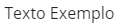

.. role:: raw-html-m2r(raw)
   :format: html

Label
=====

``<vs-label>`` é utilizado para exibir textos de forma padronizada.

----

Exemplos
========

Utilização básica
-----------------

Para utilizar o ``<vs-label>``\ , basta simplesmente passar o texto a ser mostrado na propriedade ``label``\ :

.. code-block:: html

   <vs-label label="Texto Exemplo" ></vs-label>

Resultado:

Estilos de texto
----------------

A propriedade ``model`` permite que o estilo do texto seja modificado, e deve ser utilizada da seguinte maneira:

.. code-block:: html

   <vs-label label="Texto Exemplo" model="<MODEL>"></vs-label>

Onde ``<MODEL>`` é o tipo desejado. A tabela a seguir demonstra todos os estilos disponíveis:

.. list-table::
   :header-rows: 1

   * - Estilo
     - Resultado
     - Caso de uso
   * - ``main_title``
     - 
     .. image:: ./assets/main_title.png
        :target: ./assets/main_title.png
        :alt: 
     
     - Títulos principais
   * - ``title``
     - 
     .. image:: ./assets/title.png
        :target: ./assets/title.png
        :alt: 
     
     - Títulos
   * - ``sub_title``
     - 
     .. image:: ./assets/sub_title.png
        :target: ./assets/sub_title.png
        :alt: 
     
     - Subtítulos
   * - ``aux_title``
     - 
     .. image:: ./assets/aux_title.png
        :target: ./assets/aux_title.png
        :alt: 
     
     - Títulos secundários
   * - ``small_title``
     - 
     .. image:: ./assets/small_title.png
        :target: ./assets/small_title.png
        :alt: 
     
     - Títulos terciários
   * - ``extra_title``
     - 
     .. image:: ./assets/extra_title.png
        :target: ./assets/extra_title.png
        :alt: 
     
     - Títulos quaternários
   * - ``text``
     - 
     .. image:: ./assets/text.png
        :target: ./assets/text.png
        :alt: 
     
     - Textos em geral
   * - ``label``
     - 
     .. image:: ./assets/label.png
        :target: ./assets/label.png
        :alt: 
     
     - Pequenos textos
   * - ``link``
     - 
     .. image:: ./assets/link.png
        :target: ./assets/link.png
        :alt: 
     
     - Links
   * - ``error``
     - 
     .. image:: ./assets/error.png
        :target: ./assets/error.png
        :alt: 
     
     - Textos de erro

Tooltips
--------

Ver `Tooltips <./../../api#tooltips>`_

API
===

VsLabelModule
-------------

``import { VsLabelModule } from '@viasoft/components/label';``

VsLabelComponent
----------------

Inputs
^^^^^^

.. list-table::
   :header-rows: 1

   * - Nome
     - Descrição
     - Tipo
     - Valor padrão
   * - ``model``
     - Estilo do texto
     - ``main_title`` | ``title`` | ``sub_title`` | ``aux_title`` | ``small_title`` | ``extra_title`` | ``text`` | ``label`` | ``link`` | ``error``
     - ``label``
   * - ``classes``
     - Classes de CSS a serem aplicadas ao texto (separadas por espaço)
     - ``string``
     - 
   * - ``tooltip``
     - Texto a ser mostrado no balão de dica\ :raw-html-m2r:`[[1]](#anotacoes)` (mostrado ao passar o mouse sobre o texto)
     - ``string``
     - 
   * - ``tooltipPosition``
     - Posição do balão de dica
     - ``above`` | ``below`` | ``left`` | ``right`` | ``before`` | ``after``
     - ``below``
   * - ``label``
     - Texto a ser mostrado no rótulo\ :raw-html-m2r:`[[1]](#anotacoes)`
     - ``string``

Outputs
^^^^^^^

.. list-table::
   :header-rows: 1

   * - Nome
     - Descrição
     - Tipo
   * - ``clickEvent``
     - Evento acionado quando o label é clicado
     - ``EventEmitter<any>``

----

:raw-html-m2r:`<b id="anotacoes">Anotações</b>`

#. Caso o texto seja uma chave de tradução, o mesmo será traduzido automaticamente.
