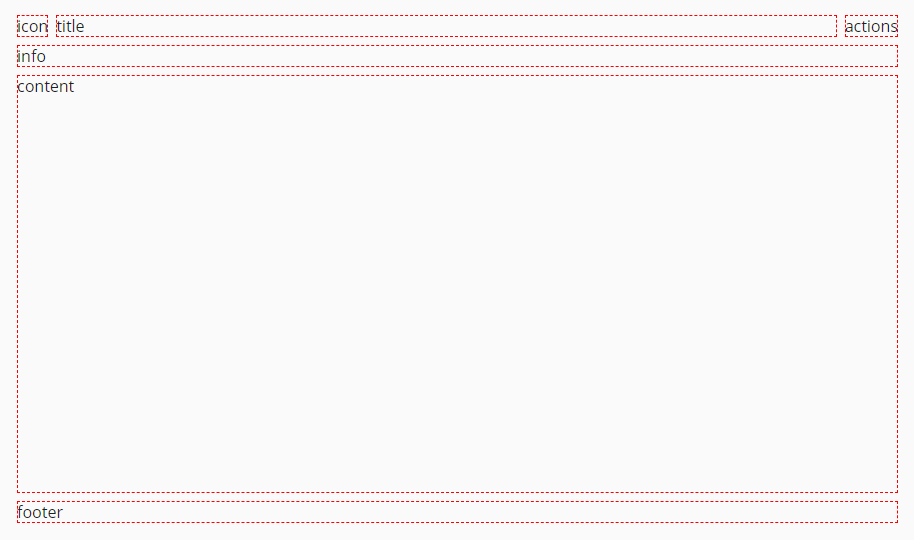
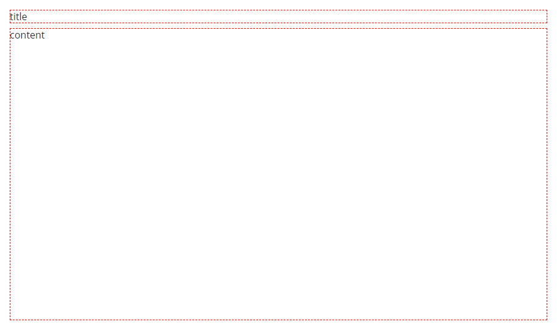
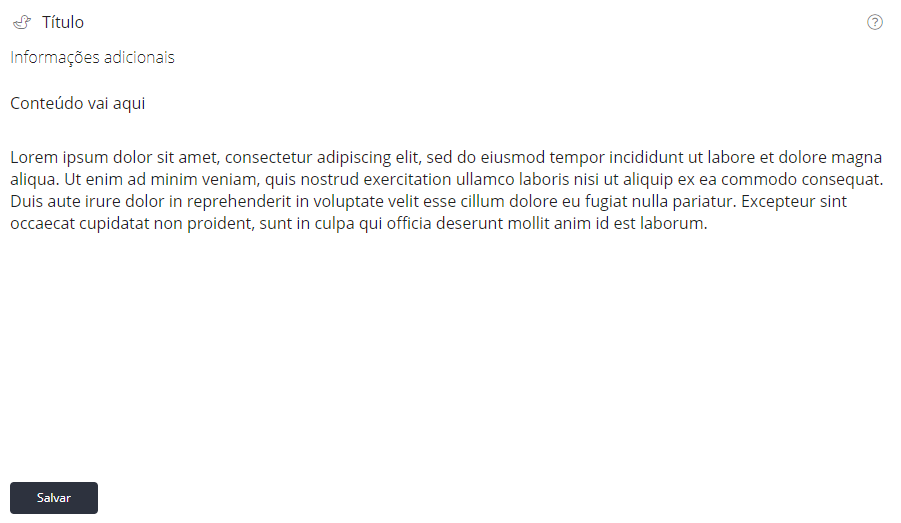

Layout
======

``<vs-layout>`` é utilizado para padronizar a disposição de itens na tela.

----

Exemplos
========

Preparação
----------

Módulo

.. code-block:: ts

   import { VsLayoutModule } from '@viasoft/components/layout';
   // ...

   @NgModule({
     // ...
     imports: [
       // ...
       VsLayoutModule
     ]
   })
   export class LayoutModule {}

Áreas
-----

Um layout é dividido em 6 áreas: ``icon``\ , ``title``\ , ``actions``\ , ``info``\ , ``content`` e ``footer``\ , sendo obrigatórias somente ``title`` e ``content``.

Com o exemplo abaixo, podemos visualizar as áreas que constituem o layout:

.. code-block:: html

   <vs-layout>

     
icon

     
title

     
actions

     
info

     
content

     
footer

   </vs-layout>

Implementando apenas as áreas obrigatórias, obtemos o seguinte resultado:

.. code-block:: html

   <vs-layout solid>

     
title

     
content

   </vs-layout>

Utilização básica
-----------------

O exemplo a seguir utiliza componentes do SDK nas áreas apropriadas:

.. code-block:: html

   <vs-layout solid>

     <vs-icon icon="duck"></vs-icon>

     <vs-label title>Título</vs-label>

     <vs-label info model="aux_title">Informações adicionais</vs-label>

     

       <vs-button model="icon" icon="question-circle"></vs-button>
     

     

       

         Conteúdo vai aqui
       

       

         Lorem ipsum dolor sit amet, consectetur adipiscing elit, sed do eiusmod tempor incididunt ut labore et dolore magna aliqua. Ut enim ad minim veniam, quis nostrud exercitation ullamco laboris nisi ut aliquip ex ea commodo consequat. Duis aute irure dolor in reprehenderit in voluptate velit esse cillum dolore eu fugiat nulla pariatur. Excepteur sint occaecat cupidatat non proident, sunt in culpa qui officia deserunt mollit anim id est laborum.
       

     

     

       <vs-button type="save">Salvar</vs-button>
     

   </vs-layout>

Para obter um fundo branco, basta adicionar a propriedade ``solid``\ :

.. code-block:: html

   <vs-layout solid>
     <!-- ... -->
   </vs-layout>

Overflow
--------

Quando um layout possui overflow no ``content``\ , é adicionado um scroll em ambos os eixos, enquanto um overflow no ``footer`` adiciona scroll apenas horizontal. Overflow em outras áreas deve ser implementado caso a caso.

Footer
------

O atributo ``align-right`` pode ser adicionado ao ``footer`` para alinhar os items à direita (por exemplo, em modais de confirmação).

Altura
------

Por padrão, um ``vs-layout`` sem altura definida crescerá baseado em seu conteúdo. Para fazer com que ele preencha 100% da altura de seu container, adicione o atributo ``fill``\ :

.. code-block:: html

   <vs-layout fill>
     <!-- ... -->
   </vs-layout>

Observações
-----------

Se um componente possui uma propriedade com o mesmo nome que uma área do ``vs-layout``\ , será necessário definir ambos:

.. code-block:: html

   <vs-layout>
     <vs-icon icon [icon]="getIcon()"></vs-icon>
     <!-- ... -->
   </vs-layout>
