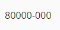

Mask
====

Esta página contém informações gerais sobre a funcionalidade de máscara, a qual é utilizada por vários componentes do SDK e também pode ser utilizada independentemente.

----

Exemplos
========

Pipe
----

Módulo:

.. code-block:: ts

   import { MaskResolverService } from '@viasoft/components/shared';
   import { IMaskModule } from 'angular-imask';
   // ...

   @NgModule({
     // ...
     imports: [
       // ....
       IMaskModule
     ],
     providers: [
       MaskResolverService
     ]
   })
   export class MyModule {}

Componente:

.. code-block:: ts

   import { MaskResolverService } from '@viasoft/components';
   // ...

   @Component({/* ... */})
   export class LabelComponent implements OnInit {
    // ...
     mask: any;

     constructor(private maskResolver: MaskResolverService) {
       // Nesse exemplo utilizaremos o MaskResolverService para buscar a máscara
       // de CEP
       this.mask = this.maskResolver.getMask('zipcode');
     }

     // ...
   }

.. code-block:: html

   
{{ '80000000' | imask:mask }}

Resultado:

API
===

MaskResolverService
-------------------

.. code-block:: ts

   import { MaskResolverService } from '@viasoft/components/shared';
   import { IMaskModule } from 'angular-imask';
   // ...

   @NgModule({
     // ...
     imports: [
       // ....
       IMaskModule
     ],
     providers: [
       MaskResolverService
     ]
   })
   export class MyModule {}

``getMask(input: any)``
^^^^^^^^^^^^^^^^^^^^^^^^^^^

Método que recebe uma string ou ``VsMask`` e retorna uma máscara válida para o IMask.

VsMask
------

``VsMask`` é a interface base da qual as máscaras herdam.

.. list-table::
   :header-rows: 1

   * - Propriedade
     - Descrição
     - Tipo
   * - ``type``
     - Define o tipo da máscara
     - ``string``

VsZipCodeMask
^^^^^^^^^^^^^

.. list-table::
   :header-rows: 1

   * - Propriedade
     - Descrição
     - Tipo
   * - ``type``
     - 
     - ``'zipcode'``

VsPhoneMask
^^^^^^^^^^^

.. list-table::
   :header-rows: 1

   * - Propriedade
     - Descrição
     - Tipo
   * - ``type``
     - 
     - ``'phone'``
   * - ``options``
     - Opções da máscara
     - 
   * - ``options.digits``
     - Define quantos dígitos de telefone a máscara deve aceitar (excluindo DDD)
     - ``8`` | ``9``

VsCnpjCpfMask
^^^^^^^^^^^^^

.. list-table::
   :header-rows: 1

   * - Propriedade
     - Descrição
     - Tipo
   * - ``type``
     - 
     - ``'cnpj-cpf'``
   * - ``options``
     - Opções da máscara
     - 
   * - ``options.accept``
     - Define se a máscara deve aceitar apenas CNPJs, CPFs ou ambos
     - ``'cnpj'`` | ``'cpf'`` | ``'both'``

VsCustomMask
^^^^^^^^^^^^

.. list-table::
   :header-rows: 1

   * - Propriedade
     - Descrição
     - Tipo
   * - ``type``
     - 
     - ``'currency'``
   * - ``options``
     - Opções da máscara
     - 
   * - ``options.preset``
     - Define os separadores pré-definidos de moedas comuns
     - ``'BRL'`` | ``'USD'`` | ``'EUR'`` | ``'GBP'``
   * - ``options.scale``
     - Número de casas decimais
     - ``number``
   * - ``options.min``
     - Valor mínimo aceito pelo campo
     - ``number``
   * - ``options.max``
     - Valor máximo aceito pelo campo
     - ``number``
   * - ``options.thousandsSeparator``
     - Separador utilizado a cada 3 dígitos (da direita para a esquerda)
     - ``string``
   * - ``options.radix``
     - Separador das casas decimais
     - ``string``

