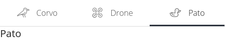
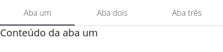
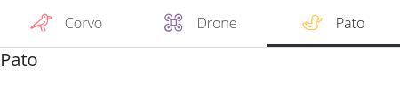
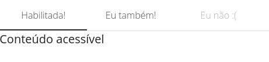

Tab Group
=========

``<vs-tab-group>`` proporciona navegação por abas personalizáveis.

----

Exemplos
========

Utilização básica
-----------------

Para criar um grupo de abas, o componente ``<vs-tab-group>`` é utilizado. Cada aba dentro dele deve ser um elemento com a diretiva ``vsTabLabel``\ , a qual contém as informações da aba (ver `\ ``VsTabDirective`` <../api#vstabdirective>`_\ ), e o conteúdo a ser mostrado por cada aba deve ficar dentro desse elemento.

.. code-block:: html

   <vs-tab-group>
       

           Conteúdo da aba um
       

       

           Conteúdo da aba dois
       

       

           Conteúdo da aba três
       

   </vs-tab-group>

Ícone
-----

Para adicionar ícones às abas, deve-se atribuir um nome de ícone do `FontAwesome <https://fontawesome.com/icons?d=gallery&s=light>`_ à propriedade ``icon``\ :

.. code-block:: html

   <vs-tab-group>
       

           Pássaros não existem
       

       

           São todos drones disfarçados
       

       

           Pato
       

   </vs-tab-group>

.. image:: ./assets/icon.png
   :target: ./assets/icon.png
   :alt: <vs-tab-group> Icon demo

Cor
^^^

Para alterar a cor dos ícones, modifique a propriedade ``color``\ :

.. code-block:: html

   <vs-tab-group>
       

           Pássaros não existem
       

       

           São todos drones disfarçados
       

       

           Pato
       

   </vs-tab-group>

Desabilitação
-------------

Uma aba pode ser desabilitada alterando o parâmetro ``disabled``\ , o qual pode ser um ``boolean`` ou um ``Observable`` de ``boolean``\ :

.. code-block:: html

   <vs-tab-group>
       

           Conteúdo acessível
       

       

           Acessível, o conteúdo daqui é
       

       

           Segredos
       

   </vs-tab-group>

Roteamento
----------

Em certos casos, é preciso que uma aba troque a rota da aplicação e mostre o conteúdo daquela rota dentro dela. Para isso, é utilizado o parâmetro ``route``\ :

.. code-block:: html

   <vs-tab-group>
       

       

       

   </vs-tab-group>

Rota base
^^^^^^^^^

Para rotas com filhos, utiliza-se a propriedade ``endRouteBase`` no ``<vs-tab-group>``\ :

.. code-block:: html

   <vs-tab-group endRouteBase="birds">
       

           Caw caw (barulhos de corvo)
       

       

       

   </vs-tab-group>

Nesse exemplo, a configuração das rotas é a seguinte:

.. code-block:: ts

   RouterModule.forChild([{
       path: 'birds',
       component: BirdsComponent,
       children: [
           { path: 'drone', component: DroneComponent },
           { path: 'duck', component: DuckComponent },
       ]
   }]);

É demonstrado também que é possível haver abas com conteúdo estático e abas com roteamento no mesmo ``<vs-tab-group>``.

API
===

VsTabGroupModule
----------------

``import { VsTabGroupModule } from '@viasoft/components/tab-group';``

VsTabGroupComponent
-------------------

``<vs-tab-group>``

Inputs
^^^^^^

.. list-table::
   :header-rows: 1

   * - Nome
     - Descrição
     - Tipo
   * - ``endRouteBase``
     - Rota a ser utilizada como base para todos os links de rota
     - ``string``

Outputs
^^^^^^^

.. list-table::
   :header-rows: 1

   * - Nome
     - Descrição
     - Tipo
   * - ``tabIndexChanged``
     - Emite o índice da aba selecionada
     - ``EventEmitter<number>``
   * - ``selectedItemChanged``
     - Emite as informações da aba selecionada
     - ``EventEmitter<``\ `\ ``VsTabDirective`` <#vstabdirective>`_\ ``>``

VsTabDirective
--------------

``<element *vsTabLabel="">``

Inputs
^^^^^^

.. list-table::
   :header-rows: 1

   * - Nome
     - Descrição
     - Tipo
   * - ``vsTabLabel``
     - Título ou informações da aba
     - ``string`` | `\ ``ITabInfo`` <#itabinfo>`_

ITabInfo
--------

Propriedades
^^^^^^^^^^^^

.. list-table::
   :header-rows: 1

   * - Nome
     - Descrição
     - Tipo
   * - ``title``
     - Título da aba
     - ``string``
   * - ``icon``
     - Ícone da aba
     - ``string``
   * - ``color``
     - Cor do ícone da aba
     - ``string``
   * - ``route``
     - Rota a ser utilizada quando a aba é clicada
     - ``string``
   * - ``disabled``
     - Define se a aba deve ser desativada ou não
     - ``boolean`` | ``Observable<boolean>``

