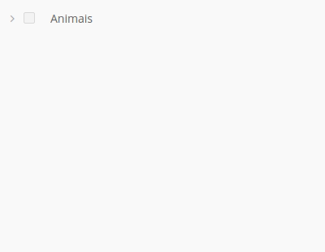
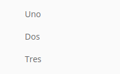
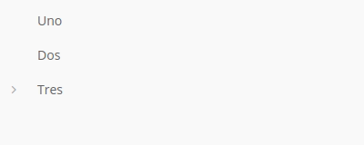
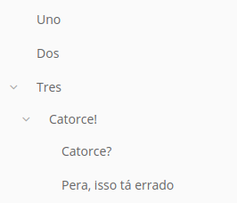
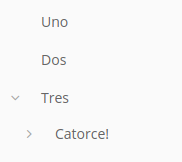
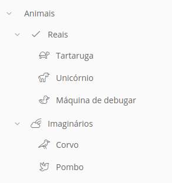
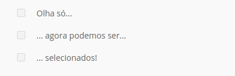
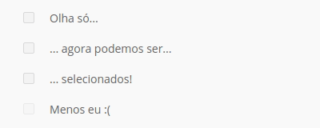
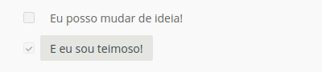
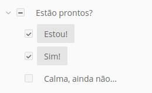

Tree View
=========

``<vs-tree-view>`` permite a disposição de dados em forma de árvore.

----

Exemplos
========

Antes de começar
----------------

O template utilizado em todos os exemplos será o seguinte:

.. code-block:: html

   <vs-tree-view [config]="config"></vs-tree-view>

E o código padrão dentro do controller será o seguinte:

.. code-block:: ts

   // ...
   import { VsTreeViewConfig } from '@viasoft/components/tree-view';
   // ...

   @Component( /* ... */ )
   export class MyComponent implements OnInit {

       config: VsTreeViewConfig;

       // ...

       ngOnInit() {
           this.configureTreeView()
       }

       configureTreeView() {
           this.config = new VsTreeViewConfig();
           // Código demonstrado vai aqui
           // ...
       }
   }

Uso
---

Utilização básica
^^^^^^^^^^^^^^^^^

No código seguinte, criaremos uma vs-tree-view simples, sem seleção, mostrando o campo "name" de nossos dados. Nenhum dos nós terá filhos.

.. code-block:: ts

   configureTreeView() {

       this.config = new VsTreeViewConfig();

       this.config.key = "name";

       this.config.onLoad = () => {

           // Aqui estamos retornando dados de uma lista estática,
           // definida localmente em nosso código.

           return of(sample_data);
       }

       // ...

   }

   // ...

   const sample_data = [
     {
       data: {
         name: "Uno"
       },
     },
     {
       data: {
         name: "Dos"
       },
     },
     {
       data: {
         name: "Tres"
       },
     },
   ]

Dessa maneira, a tree-view funciona simplesmente como uma lista:

Adicionando filhos aos nós
^^^^^^^^^^^^^^^^^^^^^^^^^^

Se alterarmos o código do exemplo anterior para que um de nossos nós possua ``children``...

.. code-block:: ts

   // ...

   const sample_data = [
     {
       data: {
         name: "Uno"
       },
     },
     {
       data: {
         name: "Dos"
       },
     },
     {
       data: {
         name: "Tres"
       },
       children: [
         {
           data: {
             name: "Catorce!"
           }
         }
       ]
     },
   ]

... obtemos o seguinte resultado:

Um nó pode ter uma quantidade ilimitada de filhos, assim como seus filhos podem ter filhos, e os filhos deles também... por assim vai.

Expansão de nós
^^^^^^^^^^^^^^^

Por padrão, um nó com filhos será fechado. Podemos alterar a propriedade ``expanded`` de um nó para que ele esteja expandido desde o início:

.. code-block:: ts

   // ...

   const sample_data = [
     {
       data: {
         name: "Uno"
       },
     },
     {
       data: {
         name: "Dos"
       },
     },
     {
       data: {
         name: "Tres"
       },
       expanded: true, // aqui!
       children: [
         {
           data: {
             name: "Catorce!"
           },
           children: [
             {
               data: {
                 name: "Catorce?"
               }
             },
             {
               data: {
                 name: "Pera, isso tá errado"
               }
             }
           ]
         }
       ]
     },
   ]

Como você pode notar, isso só afeta o nó em si e não seus filhos. Para que os filhos também sejam expandidos, é necessário alterar a propriedade ``expanded`` deles também.

Adicionando ícones aos nós
^^^^^^^^^^^^^^^^^^^^^^^^^^

É possível também adicionar ícones aos nós através da propriedade ``icon``. Ela aceita ícones do `FontAwesome <https://fontawesome.com/icons?d=listing&s=light>`_\ :

.. code-block:: ts

   // ...

   const sample_data = [
     {
       data: {
         name: "Animais"
       },
       children: [
         {
           data: {
             name: "Reais"
           },
           icon: 'check',
           children: [
             {
               data: {
                 name: "Tartaruga"
               },
               icon: 'turtle'
             },
             {
               data: {
                 name: "Unicórnio"
               },
               icon: 'unicorn'
             },
             {
               data: {
                 name: "Máquina de debugar"
               },
               icon: 'duck'
             },
           ]
         },
         {
           data: {
             name: "Imaginários"
           },
           icon: 'cloud-rainbow',
           children: [
             {
               data: {
                 name: "Corvo"
               },
               icon: 'crow'
             },
             {
               data: {
                 name: "Pombo"
               },
               icon: 'dove'
             },
           ]
         },
       ]
     },
   ]

Seleção
^^^^^^^

Para ativarmos a seleção da tree-view, devemos mudar algumas opções no `\ ``VsTreeViewConfig`` <./index.rst#treeviewconfig>`_\ :

.. code-block:: ts

   configureTreeView() {

       // Mesmo código de antes vai aqui
       // ...

       this.config.selectionMode = "checkbox";

       this.config.onSelect = (selection: any[]) => {
           // Assim que algum nó for adicionado ou removido da seleção,
           // esse código será executado. O parâmetro "selection" possui
           // todos os nós selecionados e você pode fazer o que quiser
           // com eles, mas é recomendado salvar o estado de seleção deles
           // na sua fonte de dados remota.
           console.log(selection);
       }

   }

Pré-seleção de nós
~~~~~~~~~~~~~~~~~~

Um nó pode estar pré-selecionado, basta mudar a propriedade ``selected`` dele:

.. code-block:: ts

   {
       data: {
           name: "Nó"
       },
       selected: true // aqui!
   }

Desativar a seleção de um nó
~~~~~~~~~~~~~~~~~~~~~~~~~~~~

Para prevenir que um nó específico seja selecionado, basta setar a propriedade ``selectable`` do nó para ``false``\ :

.. code-block:: ts

   // ...

   const sample_data = [
     {
       data: {
         name: "Olha só..."
       }
     },
     {
       data: {
         name: "... agora podemos ser..."
       }
     },
     {
       data: {
         name: "... selecionados!"
       }
     },
     {
       data: {
         name: "Menos eu :("
       },
       selectable: false // aqui!
     }
   ]

Note que um nó pode ser não selecionável, mas ainda assim estar pré-selecionado:

.. code-block:: ts

   // ...

   const sample_data = [
     {
       data: {
         name: "Eu posso mudar de ideia!"
       }
     },
     {
       data: {
         name: "E eu sou teimoso!"
       },
       selectable: false,
       selected: true,
     }
   ]

Seleção parcial
~~~~~~~~~~~~~~~

Quando um nó possui filhos e nem todos estão selecionados, ele será selecionado *parcialmente*. Isso significa que ele não estará incluso na lista de seleção, mas terá um indicador visual que alguns de seus filhos estão selecionados.

API
===

VsTreeViewConfig
----------------

``import { VsTreeViewConfig } from '@viasoft/components/tree-view';``

Propriedades
^^^^^^^^^^^^

.. list-table::
   :header-rows: 1

   * - Nome
     - Descrição
     - Tipo
   * - ``key``
     - Campo a ser mostrado como título do nó
     - ``string``
   * - ``selectionMode``
     - Modo de seleção
     - `undefined
     - 'checkbox'`

Callbacks
^^^^^^^^^

.. list-table::
   :header-rows: 1

   * - Nome
     - Descrição
     - Parâmetro(s)
     - 
     - Retorno
     - 
   * - ``onLoad``
     - Evento chamado no carregamento do tree-view
     - 
     - 
     - ``Observable<Array<``\ `\ ``VsTreeViewNode`` <#vstreeviewnode>`_\ ``>>``
     - ``Observable`` de array com os nós
   * - ``onSelect``
     - Evento chamado ao adicionar ou remover uma seleção
     - ``selection: any[]``
     - Array com todos os nós selecionados
     - 

VsTreeViewNode
--------------

``import { VsTreeViewNode } from '@viasoft/components/tree-view';``

Propriedades
^^^^^^^^^^^^

.. list-table::
   :header-rows: 1

   * - Nome
     - Descrição
     - Tipo
   * - ``data``
     - Dados do nó
     - ``any``
   * - ``icon?``
     - Ícone do FontAwesome a ser mostrado ao lado do nó
     - ``string``
   * - ``children?``
     - Filhos do nó
     - ``Array<``\ `\ ``VsTreeViewNode`` <#vstreeviewnode>`_\ ``>``
   * - ``selectable?``
     - Define se o nó pode ou não ser selecionado
     - ``boolean``
   * - ``selected?``
     - Define se o nó deve ser pré-selecionado
     - ``boolean``
   * - ``expanded?``
     - Define se o nó deve ser expandido
     - ``boolean``
   * - ``partialSelected?``
     - Define se o nó está parcialmente selecionado, ou seja, se ao menos um, mas não todos os seus filhos estão selecionados. **Esta propriedade é definida automaticamente pelo componente e não deve ser utilizada.**
     - ``boolean``
