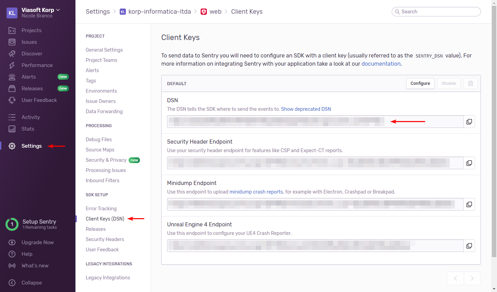

Error monitoring setup
======================

To get started with monitoring errors in your application, first make sure you're running SDK 5.1 or above. You'll need to make a few changes in your app.

Getting the Sentry DSN
----------------------

First, obtain the Sentry DSN URL for the project you wish to report to. If you have an account, this can be found in Settings > Projects > Project Name > Client Keys (DSN).

We're going to use this URL so we can make sure Sentry is working correctly in our project, but we recommend swapping it out for a string like ``!SENTRY_DSN`` that can be replaced during app build.

If you don't have an account, get in contact with the SDK or DevOps Teams.

Providing the Sentry DSN
------------------------

Now that you have the DSN URL, you can provide it in your ``VsAppCoreModule.forRoot()`` or ``VsCommonModule.forRoot()`` configuration like so:

.. code-block:: ts

   @NgModule({
     // ...
     imports: [
       // ...
       VsCommonModule.forRoot({
         // ...
         sentryDsn: 'https://<redacted>@<redacted>.ingest.sentry.io/<redacted>'
       }),
     ],
   })
   export class AppModule {
     // ...
   }

To make sure Sentry is working, run your project in your usual development configuration. Errors should still be printing to the console, and you won't see anything show up in Sentry.

Running you project in production mode (meaning the ``production`` flag in your environment file is set to ``true``\ ) should enable Sentry. Now, errors will no longer show up in the console and will instead be sent to Sentry. You can check this by going to the Network tab in Chrome DevTools and verifying that a request to Sentry is being sent. Errors will show up in the Issues tab in Sentry.

After you're done testing, don't forget to swap out the DSN URL for ``!SENTRY_DSN``.

Sending dependency data
-----------------------

If you want your error logs to be more useful, you can opt for sending your ``package.json`` data, such as project name and version, dependencies, and devDependencies.

First, go to your app's ``tsconfig.app.json`` and set the ``resolveJsonModule`` property to ``true`` in ``compilerOptions``\ :

.. code-block:: json

   {
     // ...
     "compilerOptions": {
       // ...
       "resolveJsonModule": true
     }
   }

Then, in your ``VsAppCoreModule.forRoot()`` or ``VsCommonModule.forRoot()`` you'll need to provide the ``packageJson`` property. Make sure you're pointing to the *root* ``package.json``\ , containing your project dependencies.

.. code-block:: ts

   import * as packageJson from '../../../../package.json';
   // ...

   @NgModule({
     // ...
     imports: [
       // ...
       VsCommonModule.forRoot({
         // ...
         packageJson: packageJson // here
       }),
     ],
   })
   export class AppModule {
     // ...
   }

If your IDE complains about the ``json`` import, manually restarting it should solve the problem. You should also restart your ``serve``.

You can now run your app in ``production`` mode and manually throw an exception to make sure the correct data is being sent.
