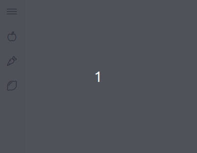
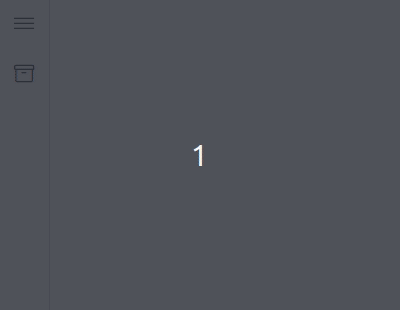

.. role:: raw-html-m2r(raw)
   :format: html

Configuração
============

Estrutura
---------

Para manter a organização e a consistência entre projetos, seu app deve seguir algumas regras de estrutura.

Pastas
^^^^^^

Clique nos links dos arquivos ou diretórios para ver como devem ser configurados.

.. raw:: html

  <pre>
  
   └── project/
       ├── e2e/
       ├── node_modules/
       ├── src/
       │   ├── app/
       │   │   ├── pages/
       │   │   │   ├── abc/
       │   │   │   │   ├── <strong><a href="#i18n">i18n/</a></strong>
       │   │   │   │   │   ├── en.ts
       │   │   │   │   │   └── pt.ts
       │   │   │   │   ├── abc-list/
       │   │   │   │   ├── abc-detail/
       │   │   │   │   ├── <strong><a href="#file_abc_routing_module_ts">abc-routing.module.ts</a></strong>
       │   │   │   │   └── <strong><a href="#file_abc_module_ts">abc.module.ts</a></strong>
       │   │   │   ├── def/
       │   │   │   ├── ghi/
       │   │   │   ├── <strong><a href="#file_pages_routing_module_ts">pages-routing.module.ts</a></strong>
       │   │   │   └── <strong><a href="#file_pages_module_ts">pages.module.ts</a></strong>
       │   │   └── <strong><a href="#file_app_module_ts">app.module.ts</a></strong>
       │   ├── <strong><a href="../installation#assets">assets/</a></strong>
       │   │   ├── apps.svg
       │   │   └── nav.svg
       │   ├── environments/
       │   │   └── ...
       │   ├── browserslist
       │   ├── favicon.ico
       │   ├── <strong><a href="#file_index_html">index.html</a></strong>
       │   ├── karma.conf.js
       │   ├── main.ts
       │   ├── polyfills.ts
       │   ├── <strong><a href="../installation#no-stylesscss">styles.scss</a></strong>
       │   ├── test.ts
       │   ├── tsconfig.app.json
       │   ├── tsconfig.spec.json
       │   └── tslint.json
       ├── .gitignore
       ├── <strong><a href="../installation#autenticacao-do-fontawesome">.npmrc</a></strong>
       ├── <strong><a href="../installation#no-angularjson">angular.json</a></strong>
       ├── package.json
       ├── README.rst
       ├── tsconfig.json
       └── tslint.json
  </pre>

Módulos e componentes
^^^^^^^^^^^^^^^^^^^^^

``AppModule`` e ``index.html``

Primeiramente, devemos apagar os seguintes arquivos:

- ``app.component.html``
- ``app.component.scss``
- ``app.component.ts``

E editar os seguintes arquivos:

``app.module.ts``

.. code-block:: ts
  
   import { NgModule } from '@angular/core';
   import { RouterModule } from '@angular/router';

   import { VsHttpModule, API_GATEWAY } from '@viasoft/http';
   import { VsAppCoreModule } from '@viasoft/app-core';
   import { VsNavigationViewComponent } from '@viasoft/navigation';

   @NgModule({
    declarations: [],
    imports: [
      <strong>VsHttpModule</strong>,
      <strong>VsAppCoreModule</strong>.forRoot( Ver <strong><a href="#appcore">AppCore</a></strong> ),
      <strong><a href="#rotas">RouterModule</a></strong>.forRoot([
        { path: '', loadChildren: './pages/pages.module#PagesModule' }
      ])
    ],
    providers: [
      { provide: API_GATEWAY, useValue: 'http://192.168.99.100:9999' }
    ],
    bootstrap: [<strong>VsNavigationViewComponent</strong>]
   })
   export class AppModule { }
  
``index.html``

.. code:: html

   <!doctype html>
   <html lang="en">

      <head>
          <meta charset="utf-8">
          <title>App Title</title>
          <base href="/">
          <meta name="viewport" content="width=device-width, initial-scale=1">
          <link rel="icon" type="image/x-icon" href="favicon.ico">
      </head>

      <body>
          <!-- Trocar app-root por vs-navigation-view -->
          <vs-navigation-view></vs-navigation-view>
      </body>

   </html>

Rotas
^^^^^

Em seu app, você deve utilizar rotas **por domínio ou página**, ou seja, devemos criar os seguintes arquivos:

``pages.module.ts``

.. raw:: html

  <pre>
  

    import { NgModule } from '@angular/core';
    import { VsCommonModule } from '@viasoft/common';
    import { PagesRoutingModule } from './pages-routing.module';

    @NgModule({
      declarations: [],
      imports: [
        VsCommonModule,
        <strong>PagesRoutingModule</strong>
      ]
    })
    export class PagesModule { }
    

  </pre>

``pages-routing.module.ts``

.. raw:: html

   <pre id="__code_pages_routing_module_ts">
   
 
   import { NgModule } from '@angular/core';
   import { Routes, RouterModule } from '@angular/router';

   <strong>const routes: Routes = [
     { path: 'abc', loadChildren: './abc/abc.module#AbcModule' },
     { path: 'def', loadChildren: './def/def.module#DefModule' },
     { path: 'ghi', loadChildren: './ghi/ghi.module#GhiModule' },
     { path: '**', redirectTo: 'abc' },
   ];</strong>

   @NgModule({
     imports: [RouterModule.forChild(routes)],
     exports: [RouterModule]
   })
   export class PagesRoutingModule {}
   

   </pre>

Esse arquivo deve conter rotas que redirecionam para os módulos de cada
página ou domínio. Caso nenhuma rota seja encontrada, deve ser definida
uma página padrão para a aplicação.

Dentro do módulo (no caso, ``abc``), teríamos:

``abc.module.ts``

.. raw:: html

   <pre id="__code_abc_module_ts">
   

    import { NgModule } from '@angular/core';
    import { VsCommonModule } from '@viasoft/common';
    import { AbcRoutingModule } from './abc-routing.module';

    import { VsNavigationViewComponent } from '@viasoft/navigation';
    // ...

    @NgModule({
      declarations: [ /* Module declarations */ ],
      imports: [
        VsCommonModule.forChild( Ver <strong><a href="#traducoes">Traduções</a></strong> ),
        <strong>AbcRoutingModule</strong>
      ]
    })
    export class AbcModule { }
    

   </pre>

``abc-routing.module.ts``

.. raw:: html

   <pre id="__code_abc_routing_module_ts">
   

   import { NgModule } from '@angular/core';
   import { Routes, RouterModule } from '@angular/router';

   import { AbcListComponent } from './abc-list/abc-list.component';
   import { AbcDetailComponent } from './abc-detail/abc-detail.component';

   <strong>
   const routes: Routes = [
     { path: '', component: AbcListComponent },
     { path: 'new', component: AbcDetailComponent },
     { path: ':id', component: AbcDetailComponent },
     { path: '**', redirectTo: '' },
   ];
   </strong>

   @NgModule({
     imports: [RouterModule.forChild(routes)],
     exports: [RouterModule]
   })
   export class AbcRoutingModule {}
   

   </pre>

Onde ``AbcListComponent`` é a página principal com uma listagem de itens
e ``AbcDetailComponent`` é a página de detalhe de um item, com
funcionalidade de criação e/ou edição.

Para rotas adicionais, as seguintes regras se aplicam:

-  Sempre utilizar o inglês.

   -  :raw-html-m2r:`/abc/detail`
   -  :raw-html-m2r:`/abc/detalhes`

-  Sempre utilizar Kebab Case, ou seja, palavras em letra minúscula
   separadas por um hífen.

   -  :raw-html-m2r:`/abc/simulation-graph`
   -  :raw-html-m2r:`/abc/simulationGraph`
   -  :raw-html-m2r:`/abc/simulation_graph`

-  Nunca utilizar barras no ``path``, ao invés disso criar um sub-módulo
   com seu próprio módulo de rotas.
-  A rota *wildcard* (``**``) deve sempre redirecionar para o componente
   principal da página ou domínio (no caso, o componente de listagem de
   itens).

AppCore
-------

Dentro do ``VsAppCoreModule.forRoot()``\ , devemos passar as seguintes configurações:

.. raw:: html

   <pre id="__code_appcore">
   

   imports: [
       // ...

       VsAppCoreModule.forRoot({
           portalConfig: { Ver <strong><a href="#portalconfig">PortalConfig</a></strong> }
           navigation: { Ver <strong><a href="#navigation">Navigation</a></strong> }
       }),
   ],
   

   </pre>

PortalConfig
^^^^^^^^^^^^

:raw-html-m2r:`<!-- TODO add link to IPortalConfig API -->`
A propriedade ``portalConfig`` aceita os seguintes parâmetros:

.. code-block:: ts

   portalConfig: {
       appId: 'my-app-id', // ID único do app
       appName: 'my-app-name', // Nome do app
       domain: 'my-domain', // Domínio do app
       navbarTitle: 'My App' // Título mostrado no topo da navbar
   },

Navigation
^^^^^^^^^^

A propriedade ``navigation`` controla o menu lateral da aplicação. Recebe um array de `IItemMenuOptions <#>`_\ , ou seja, um ícone, título, e um caminho ou sub-itens.

Por exemplo, três itens simples seriam configurados da seguinte maneira:

.. code-block:: ts

   navigation: [
     {
       icon: 'apple',
       label: 'Abc',
       path: '/abc'
     },
     {
       icon: 'carrot',
       label: 'Def',
       path: '/def'
     },
     {
       icon: 'lemon',
       label: 'Ghi',
       path: '/ghi'
     },
   ]

Alternativamente, um item com três sub-items seria configurado assim:

.. code-block:: ts

   navigation: [
     {
       icon: 'archive',
       label: 'Páginas',
       children: [
         {
           icon: 'apple',
           label: 'Abc',
           path: '/abc'
         },
         {
           icon: 'carrot',
           label: 'Def',
           path: '/def'
         },
         {
           icon: 'lemon',
           label: 'Ghi',
           path: '/ghi'
         },
       ]
     }
   ]

i18n
----

Para manter a consistência entre telas, reutilizar chaves e habilitar a internacionalização das aplicações, utilizamos traduções. Em cada módulo onde utilizaremos essa funcionalidade, devemos criar um diretório chamado ``i18n``. Dentro dele criamos os arquivos ``en.ts`` e ``pt.ts``\ , contendo as traduções para o inglês e o português, respectivamente.

Por exemplo, os arquivos de tradução para o módulo ``abc`` ficariam da seguinte maneira:

``pt.ts``

.. code-block:: ts

   export const pt = {
     Abc: {
       Hello: "Olá",
       User: "Usuário",
       CloseWindow: "Fechar janela"
     }
   }

``en.ts``

.. code-block:: ts

   export const en = {
     Abc: {
       Hello: "Hello",
       User: "User",
       CloseWindow: "Close window"
     }
   }

Para importar essas chaves, configure seu módulo da seguinte maneira:

``abc.module.ts``

.. code-block:: ts

   import { pt } from './i18n/pt';
   import { en } from './i18n/en';
   // ...

   @NgModule({
     // ...
     imports: [

       VsCommonModule.forChild({
         translates: {
           pt: pt,
           en: en
         }
       }),

       // ...
     ]
   })
   export class AbcModule { }

E para utilizá-las em seus componentes:

.. code-block:: html

   {{ 'Abc.Hello' | translate }}

   <vs-button model="icon" tooltip="Abc.CloseWindow" icon="times"></vs-button>

Note que dentro de atributos de componentes do ``@viasoft/components`` não é necessário utilizar o pipe ``translate``\ , pois a busca da chave é feita automaticamente.

Regras
^^^^^^

As chaves de tradução devem seguir algumas regras:

* Nunca repetir chaves em folhas de tradução diferentes.
* Sempre utilizar o inglês para os identificadores das chaves.

  * :raw-html-m2r:`Abc.Goodbye`
  * :raw-html-m2r:`Abc.Adeus`

* Sempre utilizar Pascal Case, ou seja, palavras juntas com a primeira letra em maiúsculo.

  * :raw-html-m2r:`Abc.CloseWindow`
  * :raw-html-m2r:`abc.closeWindow`
  * :raw-html-m2r:`abc.close_window`
  * :raw-html-m2r:`abc.CLOSE_WINDOW`

* Sempre manter a consistência entre idiomas.

  * :raw-html-m2r:`"Welcome" / "Bem vindo"`
  * :raw-html-m2r:`"Welcome" / "Olá"`

* Sempre seguir as regras estruturais e gramaticais de cada idioma. Se estiver em dúvida, peça ajuda a alguém.

  * :raw-html-m2r:`"Bem vindo, usuário"`
  * :raw-html-m2r:`"Bem vindo usuario"`

* Sempre limitar o identificador a uma descrição sucinta e literal da chave de tradução.

  * :raw-html-m2r:`Abc.Hello`
  * :raw-html-m2r:`Abc.HelloMessage`
